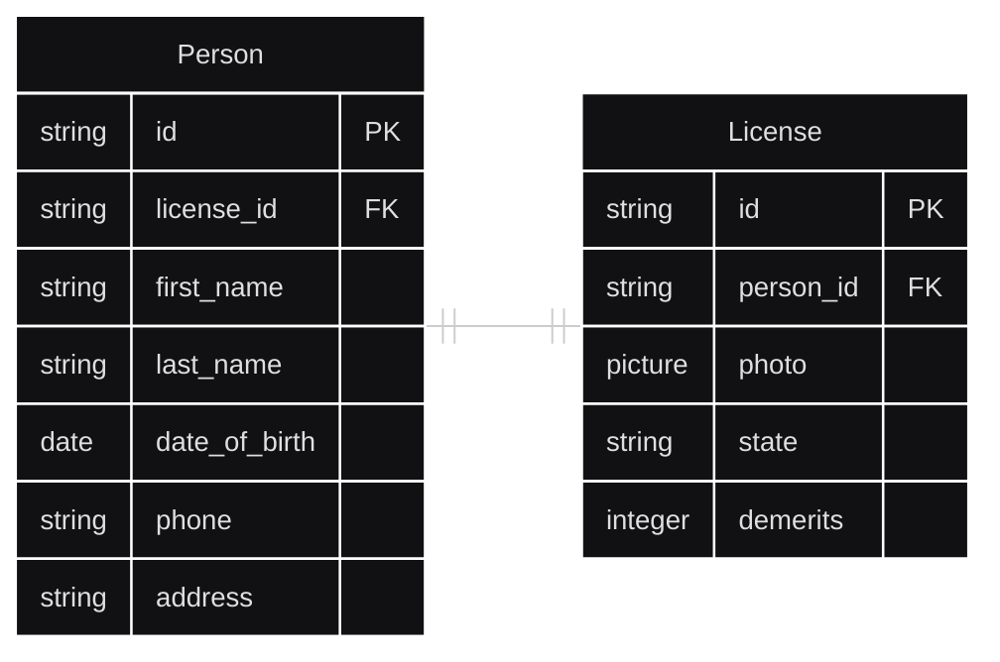
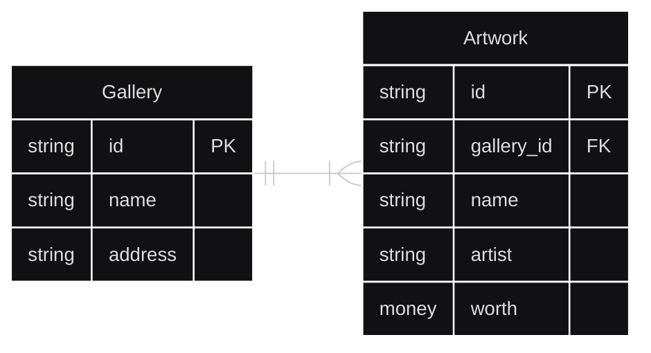
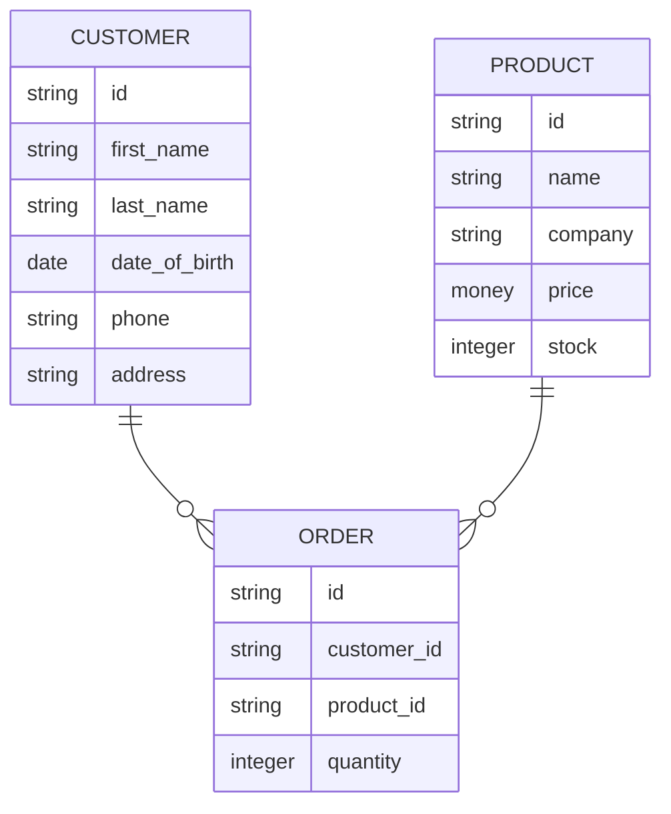

# Contents
- [Contents](#contents)
- [Week 4/Session 4 - Database Design](#week-4session-4---database-design)
  - [Overview](#overview)
  - [Relational Databases](#relational-databases)
    - [One-to-One Relationships](#one-to-one-relationships)
    - [One-to-Many Relationships](#one-to-many-relationships)
    - [Many-to-Many Relationships](#many-to-many-relationships)
  - [Resources](#resources)
  - [Activities](#activities)

# Week 4/Session 4 - Database Design
13/8/2025  
[Blackboard Lesson Materials](https://blackboard.northmetrotafe.wa.edu.au/ultra/courses/_13866_1/cl/outline)

## Overview
Relational databases and database design.

## Relational Databases
Databases generally contain many tables to contain complex information. To make sense of this complexity, the relationships between tables is described. This adds structure to the data. Tables are related to each other using a foreign key. 

Databases must be carefully designed to properly represent the data they complain and the relationships between different data points. There are three main relationship types that are seen in databases; one-to-one, one-to-many and many-to-many.

### One-to-One Relationships
An example of one-to one relationship is a table of drivers and a table of drivers licenses; each person has one driver's license and each drivers license is assigned to one person.

Note that in the example below the primary key for the table comes first, followed by the foreign key which provides the link;  The Person table has a `license_id` field that allows you to search the License table for the license belonging to that person. Similarly, the License table has a `person_id` so you can find the detail of the person if you have only their license details.

Where these types of simple relationships exist consideration should be given to merging them, however it is not always appropriate; determining when this is appropriate will be discussed further next week.



In SQL this is represented by:
```sql
Create database IF NOT EXISTS Drivers;

CREATE TABLE IF NOT EXISTS drivers(
    driver_id SERIAL PRIMARY KEY,
    license_id VARCHAR(20) REFERENCES drivers_licenses (license_id),
    first_name VARCHAR(20),
    last_name VARCHAR(20),
    birth_date date,
    phone VARCHAR(20),
    address VARCHAR(50)
    
);

CREATE TABLE IF NOT EXISTS drivers_licenses(
    license_id VARCHAR (20) PRIMARY KEY,
    driver VARCHAR(20) REFERENCES drivers (driver_id),
    photograph CHAR(4) default ‘Null’,
    state VARCHAR(20),
    demerits INT,
    last_demerit_date DATE
);
```

### One-to-Many Relationships
One to many relationships are where one object contains many of another object. An example is an art galleries relationship to it's artworks; A single art gallery contains many artworks, however an artwork only belongs to a single art gallery. 
* When documented, the "crows foot" is used to show the 'many' side of this relationship.
* The "container" (art gallery in this example) does not need a field for the ID of the contained item; note that the artwork table contains a reference to the gallery it belongs to.
*The example below is conceptual, the 'types' are not necessarily related to SQL types - choosing an appropriate SQL type-representation is part of database design.*



In SQL this is represented by:
```sql
Create database IF NOT EXISTS Art_gallery;

CREATE TABLE IF NOT EXISTS gallery(
    gallery_id SERIAL PRIMARY KEY,
    name VARCHAR(20),
    address VARCHAR(50)
    
);

CREATE TABLE IF NOT EXISTS artwork(
    art_id VARCHAR (20) PRIMARY KEY,
    gallery_id VARCHAR(20) REFERENCES gallery (gallery_id),
    work_category VARCHAR(255) DEFAULT='ART',
    artist VARCHAR(255),
    worth FLOAT(10, 2)
);
```

### Many-to-Many Relationships
Many to many relationships are complex; one object can have many interactions with another. An example is `customers` and `products`; a customer can buy many products and a product can be bought by many customers, these might be be considered 'indirect relationships'.  

In these relationships neither table has a foreign key from the other, the relationship could be supported by a formulaic operation, but this is not supported by SQL as it would add a lot of calculative overhead for large datasets.  

Instead, an "intermediary" is used; also known as a 'join table', 'bridging table', or 'joining table'. This is a table added in between the two tables which quantifies the relationship. Using the example of customers and products, this might be an 'order' table. 

Sometimes the relationship is hard to explain simply, so convention is to just use the names of the two tables (or concepts) to be joined for example `customer-product`


In SQL this is represented by:
```sql
CREATE TABLE IF NOT EXISTS customer(
    customer_id SERIAL PRIMARY KEY,
    first_name VARCHAR(20) DEFAULT NOT NULL,
    last_name VARCHAR(20),
    birth_date DATE,
    phone VARCHAR(20) default ‘00000000’,
    address VARCHAR(50)  
);

CREATE TABLE product (
    product_id VARCHAR(20) PRIMARY KEY,
    product_name VARCHAR(20),
    company VARCHAR(20),
    price FLOAT(10,2),
    stock_count INT CHECK (STOCK >=5)
  );

CREATE TABLE orders(
    order_id VARCHAR(15) PRIMARY KEY,
    customer_id INT REFERENCES customer (customer_id), 
    product_id VARCHAR(20) REFERENCES product (product_id),
    quantity INT (20),
    price FLOAT(9,2)  
);
```
___
## Resources
[Lecture Slides](./resources/04-Database-Design.pptx)  
[Class Notes](./resources/Class-Notes-Designing-Databases.pdf)

## Activities
[In-class activity](./activities/class-activities.md)  
