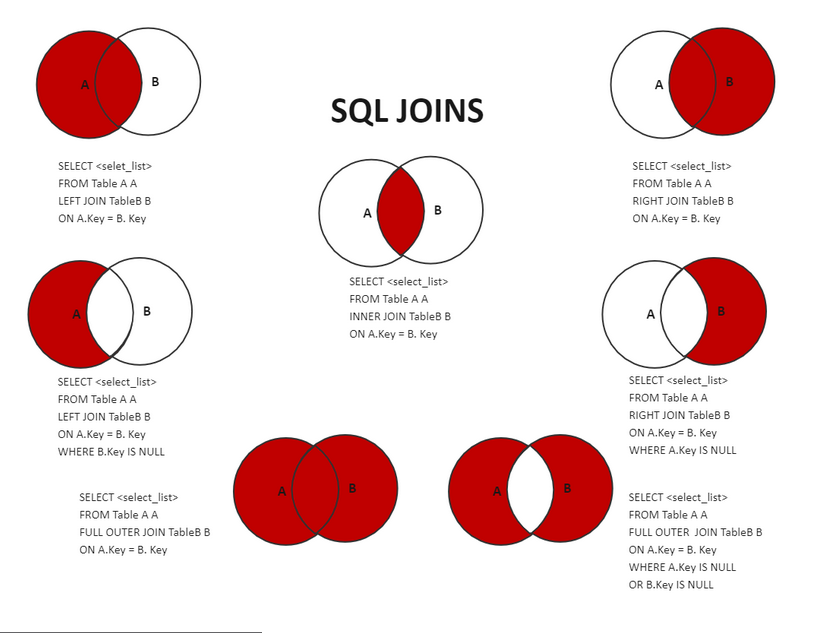
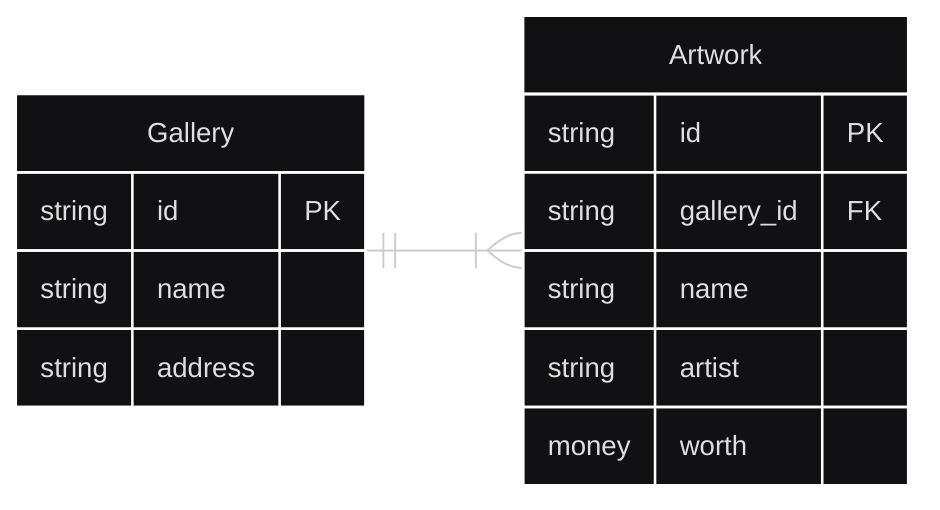

# Contents
- [Contents](#contents)
- [Week 6/Session 6 - Joins Unions and Nested Queries](#week-6session-6---joins-unions-and-nested-queries)
  - [Cool But Unrelated](#cool-but-unrelated)
  - [LIKE in Queries](#like-in-queries)
  - [Joins](#joins)
    - [Inner Join](#inner-join)
    - [Left/Right Join](#leftright-join)
  - [UNION](#union)
    - [UNION ALL](#union-all)
  - [DISTINCT](#distinct)
  - [Nested Query/Subquery](#nested-querysubquery)
    - [IN With Subqueries](#in-with-subqueries)
  - [Resources](#resources)
  - [Activities](#activities)

# Week 6/Session 6 - Joins Unions and Nested Queries
27/8/2025  
[Blackboard Lesson Materials](https://blackboard.northmetrotafe.wa.edu.au/webapps/blackboard/content/listContent.jsp?course_id=_35877_1&content_id=_3663745_1)  
[Menti Session](https://www.menti.com/al21ssorko1v)   
[Code used in class](https://github.com/paraxial-nmtafe/data-driven-applications/blob/main/6.sql)  


## Cool But Unrelated
[Para's cool timer app](https://github.com/paraxial/stream-accessories)  
- Backticks ` may be used instead of double quotes " in some SQL dialects.
- **Double quotes** are for identifiers (like column or table names).  
- **Single quotes** are for string literals.

## LIKE in Queries
The `LIKE` operator is used in SQL to search for a specified pattern in a column, typically in `VARCHAR`, `CHAR`, or `DATE` data types.  

Example from the ArtGallery database:
```sql
Use ArtGallery;

SELECT * 
FROM gallery 
WHERE address LIKE 'P%';
```
`'P%'` matches any string that starts with 'P'.  
`%` is a wildcard character that matches any number of characters (including none).  
The match is case-sensitive in most SQL dialects unless configured otherwise.  

Other common patterns:
* `'%P%'` - contains P anywhere
* `'__%'` - has a third letter 'l'
* `'P%h'` - starts with 'P' and ends with 'h'

## Joins
There are 3 ways to join tables; Union, Joins and Subqueries, though union is rarely used.  
These can often achieve similar results, but are used in different contexts depending on structure, performance, and clarity.

`JOIN` does not create a new permanent table. It forms a temporary result set by combining rows from two or more tables based on a related column.

Relational databases use foreign keys to express relationships between tables. `JOIN` allows querying across related tables. The join type used will depend on the information to be retrieved as shown in the graphic below:



[This](https://clmoffatt.blogspot.com/2008/11/sql-joins.html) article explains join types quite well.

*NOTE:* Often tables will have the same names for columns, for example `id`. dot notation is used to distinguish which tables "id" column is being referred to, for example `Gallery.id` or `Artwork.id`.


### Inner Join
The default type of join is an inner join, It returns rows where there is a match in both tables.  
At it's most basic, the syntax for joins is:
```sql
SELECT *
FROM table_a
JOIN table_b 
  ON table_b.foreign_key=table_a.primary_key
```

Using the Gallery and Artwork example from previous sessions:


```sql
SELECT Gallery.name, Artwork.name 
FROM Artwork
JOIN Gallery 
  ON Gallery.id = Artwork.gallery_id;
```
Breakdown:
* `SELECT Gallery.name, Artwork.name FROM Artwork` - Select Specific Columns from both tables
* `FROM Artwork JOIN Gallery` - defines the two tables to be joined.
* `ON Gallery.id = Artwork.gallery_id;` defines the relationship between the tables.

This will only return artworks that have a corresponding gallery.

Note that when using inner joins the table order doesn't matter. 

### Left/Right Join
These are outer joins and they return unmatched rows from one side of the join.

**Left Join:**  
Returns all records from the left table (the one before LEFT JOIN), and matched records from the right table. If there's no match, NULL is returned for columns from the right table.  
```sql
SELECT Gallery.Name, Artwork.Name 
FROM Artwork 
LEFT JOIN Gallery 
  ON Gallery.ID = Artwork.GalleryID;
```
**Right Join:**  
Returns all records from the right table, and matched records from the left table. 
```sql
SELECT Gallery.Name, Artwork.Name 
FROM Artwork 
RIGHT JOIN Gallery 
  ON Gallery.ID = Artwork.GalleryID;
```
This achieves the same result as the LEFT JOIN above, but swaps the table order.
Unlike joins/inner joins, the table order matters with left/right joins.

## UNION
`UNION` is used to combine the results of two or more `SELECT` statements into a single result set.

**Rules for UNION:**
1. Each SELECT must return the same number of columns.
2. Columns must be in the same order.
3. Columns must be of compatible data types.

This is demonstrated below using the two example tables:
**Teachers**
| id | name  | age |
|----|-------|-----|
| 1  | Peter | 32  |
| 2  | Megan | 43  |  
| 3  | Rose  | 43  |
| 4  | Linda | 30  |

**Students**
| id | name  | age |
|----|-------|-----|
| 1  | Harry | 23  |
| 2  | Jack  | 42  |  
| 3  | Joe   | 32  |
| 4  | Dent  | 23  |

```sql
SELECT age FROM teachers
UNION
SELECT age FROM students;
```
Will return: 
| age |
|-----|
| 23  |
| 30  |
| 32  |
| 42  |
| 43  |

*Note that Duplicates are removed*


### UNION ALL


The `UNION ALL` operator selects rows from two or more tables similar to `UNION`. However, unlike UNION, UNION ALL doesn't ignore duplicate rows.
```sql
SELECT age
FROM teachers
UNION ALL
SELECT age
FROM students;
```
Will return: 
| age |
|-----|
| 32  |
| 43  |
| 43  |
| 30  |
| 23  |
| 42  |
| 32  |
| 23  |

## DISTINCT
DISTINCT is used to return only unique values in the result set.
```sql
SELECT DISTINCT age FROM students;
```
It is useful when unique data without duplicates is required.

## Nested Query/Subquery

SUBQUERY  
A subquery is a query nested inside another query.  
The inner query is executed first, and its result is used by the outer query.  
The basic form of this is:
```sql
SELECT column
FROM table
WHERE column in (subquery);
```

```sql
SELECT * FROM Product
WHERE Price >= 
  (SELECT avg(price) FROM Product);
```
* Inner query `(SELECT avg(price) FROM Product)` 
* Outer query `SELECT * FROM Product WHERE Price >= ...`  

This returns all products with a price above or equal to the average price.

### IN With Subqueries
`IN` can be used with subqueries to test if a value matches any value returned by the inner query.
```sql
SELECT name 
FROM Students
WHERE age IN (
  SELECT age FROM Teachers
);
```
This returns all students whose age matches any teacher’s age.

___
## Resources
[Lecture Slides](./resources/Session-6-join-union-all-nested-queries.pptx)  
[Class Notes](./resources/Class-Notes-SQL-Joins.pdf)    

## Activities
[In-class activity](./activities/class-activities.md)  
