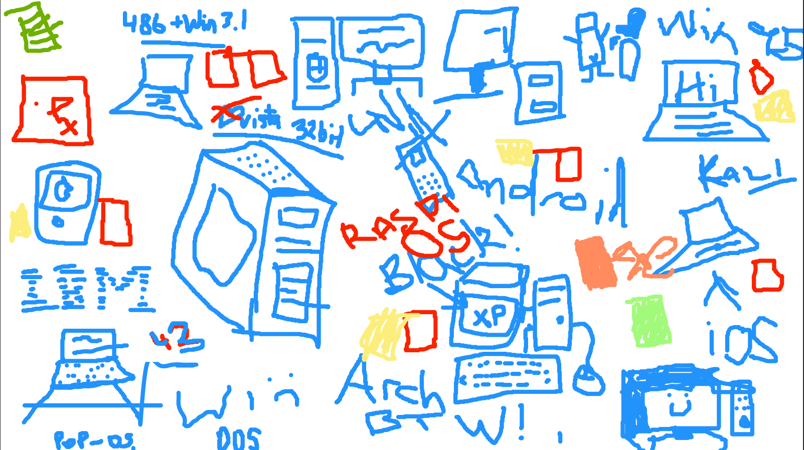

# Contents
- [Contents](#contents)
- [Week 1/Session 1 - Introductions](#week-1session-1---introductions)
  - [Totally Cool but Unrelated Content ☻](#totally-cool-but-unrelated-content-)
  - [Overview](#overview)
  - [Notes](#notes)
    - [C#](#c)
      - [Features](#features)
      - [Variables](#variables)
      - [Syntax Rules](#syntax-rules)
    - [.NET](#net)
    - [Basic Setup](#basic-setup)
  - [Resources](#resources)
  - [Activities](#activities)

# Week 1/Session 1 - Introductions
24/7/2025  
[Blackboard Lesson Materials](https://blackboard.northmetrotafe.wa.edu.au/ultra/courses/_26457_1/cl/outline)  
[Class Code](https://github.com/chris-arnold-nmtafe/csharp-sem2-2025)  

## Totally Cool but Unrelated Content ☻

## Overview
Intro to OOP and .NET

## Notes
*Install Visual Studio (Community) + extensions of C# and .NET (Need WPF - Windows Presentation Foundation).*

Overall Course Structure:  
Session 1: Basic introduction and types.  

Eventually we'll make a console app that will sort and search random number.  

Will also make a gui app that satisfies a brief (a bit like Wordle) then will focus on testing.  

### C#
C# (pronounced "C-Sharp") is a simple, modern, general-purpose, object-oriented programming language developed by Microsoft within its .NET initiative led by Anders Hejlsberg. It is widely used for the following:
- Web Development (ASP.NET)
- Desktop Applications (Windows Forms, WPF)
- Game Development (Unity)
- Cloud & AI Applications

C# is windows based and depends on [.NET](#.NET).

#### Features
- **Compiled Language:** C# is compiled, meanning all code must be written and compiled before execution. This can lead to more difficulties when compiling, but less errors during runtime.
- **Stongly Typed:** Every variable has a predefined type at compilation (unlike Python).
- **Designed With OOP In Mind:** Classes, inheritance and interfacing concepts are built into the language - everything is a class.
- **Case Sensitive:** "MyVariable" is not the same as "myvariable".
- **Business Case:** In-house (Windows based) software.

#### Variables
Variables must be defined with a specific type:  
`<Type><Identifier>;` or  
`<Type><Identifier> = <Value>;`  

The value can be reassigned, but they cannot be re-declared.
- Can only be identified with letters, numbers or underscores.
- Must start with an underscore or letter.
- Must be unique in its declared space.
- Case sensitive.

```cs
int number1 = 20; //32 bit int
long bigint = 30L; // 64 bit int
float number2 = 30.53f; // generally double is preferred over float.
double number3 = 63.98d; // 'd' is optional (best to be explicit)
    // double uses more memory, but offers better precision.
bool number4 = true;
string thingToSayToEveryone = "Hello!";
string greeting = "Hello, World! " + number3 = "; " + number4;
decimal number5 = 1.222335332235431354M;
char c = 'a';
Console.WriteLine(greeting);

int number1 = 30; // this is illegal - can't re-declare variables
number = 30 // this is OK, you can reassign the value of a variable
{
  Console.WriteLine("Hello, World!"); // print statements
  Console.WriteLine(greeting);
  Console.WriteLine(bigint);
}
```
*When reassigning a variable, the type is omitted, this makes it clear that the previous declaration is being referenced and the value is being changed*.

#### Syntax Rules
- Everything in C# needs to be part of a class
- camelCase is preferred for C#
- Classes/functions/methods are TitleCase
- Single quotes for characters, double for strings (more rigid than Python)
- Semicolons are needed to show end of line (it's dumb), but code can be written over multiple lines for readability
- There are 3 Types of comments:
  ```cs
  // Inline comment

  /* Multi
  * Line
  * Comment
  the additional stars are optional, however the "opening and closing tags" are required
  */

  /// <summary>
  /// documentation comments
  /// These can generate XML API documentation
  /// https://learn.microsoft.com/en-gb/dotnet/csharp/language-reference/xmldoc/
  /// <summary>
  ```

### .NET
.NET is a compiler that bridges the code to the kernel, includes a garbage collector.  
- A Managed application/Managed code - provides a runtime environment so code does not need to be compiled differently for every OS. Java Virtual Machine was the original, .NET Runtime Environment.
- Bridges Programmer to low level execution
- Memory Management and Garbage collection
- Faster development time
- Huge library of classes and code to utilise for different use cases and projects

.NET works by providing a CLR: Common Language Runtime, this is an intermediate language between code and assembly language. This means the program can be written in any higher level language which is then compiled into the appropriate assembly language. It is Just-In-Time-Compilation, which is slightly different to native compilers that may be used for languages like C, Rust and Go.  

### Basic Setup
In Visual Studio:
- Create a project (Console app for now)
- If desired check "Don't use top level statement" - This hides the main structure.

___
## Resources
[Lecture Slides](./resources/Introduction-to-C#-Part-1.pptx)  
[Online C# Compiler](https://www.tutorialspoint.com/compilers/online-csharp-compiler.htm)  
[Visual Studio Community Edition](https://visualstudio.microsoft.com/free-developer-offers/)  
[Tutorials Point -  C# Documentation](https://www.tutorialspoint.com/csharp/index.htm)  
Very Helpful Diagram:

*This diagram was created by online students on 24/07/2025. It very clearly illustrates how JIT-style environments (like C# CLR or Java's JRE) simply build processes, when compared to C/C++ platform targeted builds.*

## Activities
[In-class activity](./activities/class-activities.md)  

