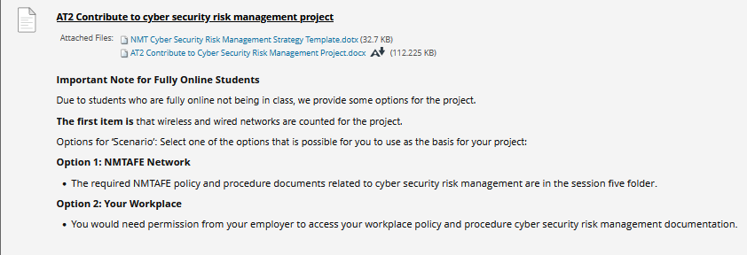

## Instructions
*Assignment due ???*  
**Submitted 14/6/2025**  
Instructions from blackboard for quick reference:
___
[Assessment 2 Support](https://tafewa.sharepoint.com/:li:/s/2025-TEST/E8-C3zukzpVKgNfTubciQAUBfdIWOx3B2LQiazRtmkWNMA?e=U8LOy7)

- watch each for help on each question

[Assessment link](https://blackboard.northmetrotafe.wa.edu.au/webapps/blackboard/content/listContent.jsp?course_id=_29702_1&content_id=_2756368_1&mode=reset)  

**Instructions:**

* [Link to Blackboard](https://blackboard.northmetrotafe.wa.edu.au/webapps/assignment/uploadAssignment?content_id=_2799330_1&course_id=_29702_1&group_id=&mode=view)  
* [Doc: Link to Assessment instructions](./resources/AT2-Contribute-to-Cyber-Security-Risk-Management-Project.docx)  
* [Doc: Risk Management Strategy Template](./resources/NMT-Cyber-Security-Risk-Management-Strategy-Template.dotx)

## Assignment Notes:
### Policy Documents needed for AT2
Example of an organization's risk management documents. Use these in your Assessments.

**NMTafe Risk Management Policies and Procedures**  
#### NMTafe Risk Management Policy PCY081.docx  
Sets out
- Scope and Principles
- Roles and Responsibilities
- Compliance requirements
- Stategic Risk Register (includes mitigation plans and NMT's risk appetite)
- Roles and Responsibilities

#### NMTafe Risk Management Procedure P081A.docx  
Sets out
- Stages are (Explained in Appendix 1, Risk Management Stages)
    * Establishment of the context
    * Risk identification
    * Risk Assessment
    * Risk Treatment
- a 10 Stage Process
- Appendix 1 Risk Management Stages (see above)
- Appendix 2 Explains Strategic, Operational and Project Risks
- Appendix 3 Contains the Risk Reference Tables.

#### NMTafe Information Security Policy PCY052.docx   
Sets out 
- Information Security Principles
- Information Security Requirements
- Roles and Responsibilities
- 10 Information Security Domains
- Background includes a discussion of the IT Risk Register which is reviewed by the IT Governance Committee quarterly.
- Related policies and procedures

#### NMTafe Cyber Security Incident Response Plan  
Sets out
- Plan Objectives
- Definition of an IT Security Incident
- Team Roles and Responsibilities
- Incident Level Declarations
- Examples of Security Incidents
- Incident Reporting Procedure
- Responding to a Security Incident
- Documentation, Tracking and Reporting

#### NMTafe Information Services Incident Mangemment Procedure P052N.docx  
Sets out
- Roles and Responsibilities
- 8-step Incident Management Procedures
- Communication (for an incident)
        Type of Outage
        Target Audience (Consider Informing),
        Action, Channel (Who will communicate)
        Channel (How to communicate)
- Definitions and acronyms

#### NMTafe Acceptable Use of IT Services (Students) Policy PCY054.docx  
Sets out
- General policy statement
- Overarching 8 principles to be followed by students with access to NMT systems
- Background information on need for this policy.  

### Feedback
