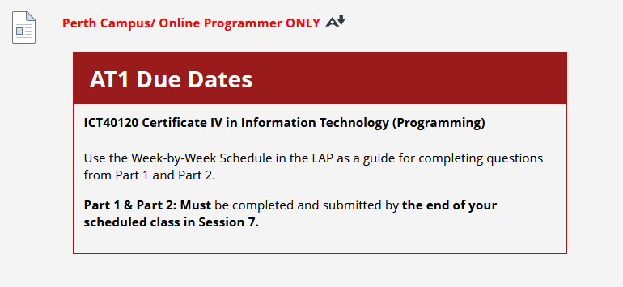
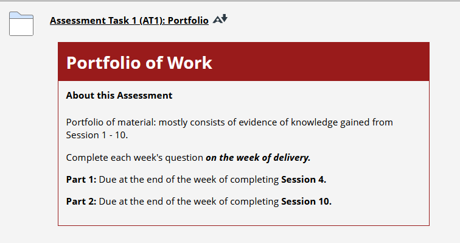

## Instructions
*Assignment due end of week 2 (officially 2/3/2025)*  
Instructions from blackboard for quick reference:
___

[Assessment link](https://blackboard.northmetrotafe.wa.edu.au/ultra/courses/_41920_1/cl/outline)  

**Due Dates Note:**  
ICTPRG302 runs at double speed for Certificate IV in Information Technology (Programming):  

**Instructions:**

**Part 1**
* [Link to Blackboard](https://blackboard.northmetrotafe.wa.edu.au/webapps/assessment/take/launchAssessment.jsp?course_id=_41920_1&content_id=_4625262_1&mode=view)  
* [Link to test submission](./part-1-test-submission.md)  

**Part 2**
* [Link to Blackboard](https://blackboard.northmetrotafe.wa.edu.au/webapps/assessment/take/launchAssessment.jsp?course_id=_41920_1&content_id=_4703841_1&mode=view)   
* [Link to test submission](./part-2-test-submission.md) 

