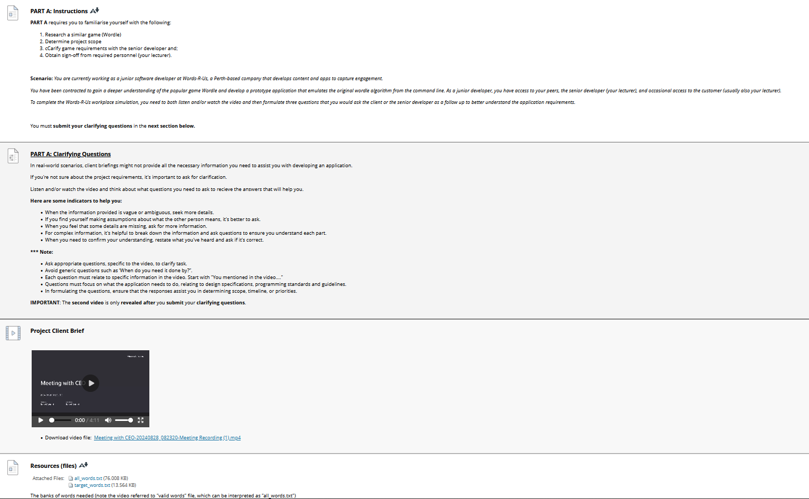

## Instructions
*Assignment due ???*  
Instructions from blackboard for quick reference:
___

[Assessment link](https://blackboard.northmetrotafe.wa.edu.au/webapps/blackboard/content/listContent.jsp?course_id=_41920_1&content_id=_4709871_1)  

**Due Dates Note:**  
ICTPRG302 runs at double speed for Certificate IV in Information Technology (Programming):  

**Instructions:**

[Link to Clarifying Questions](https://blackboard.northmetrotafe.wa.edu.au/webapps/assessment/take/launch.jsp?course_assessment_id=_152712_1&course_id=_41920_1&content_id=_4707342_1&step=null)  
[Link to Clarifying Questions Submission](./part-a-test-submission.md)  

[Link to Video](./resources/Meeting-with-CEO-20240828_082320-Meeting-Recording.mp4)

## Notes
### Briefing
I'm a new Junior Dev.  
The Client is "words-r-us" a media company looking to build engagement online
looking for new word-based games to increase their offering and engagement.

Heard of wordle? it was a sensation, gained 300,000 users in the first 2 months, eventually sold for 7 figures to NYT.  
Something that successful piqued the company interest.

### Client Requirements
* build a prototype of a clone of wordle (under guidance) in CLI to better understand the game logic, and the algorithms and how to interact with it.
* This lets the company decide if they want to to develop their own unique take on the game.
* Ensure I validate the requirements with CEO Raf, as well as Senior Developer Raf.
* Prioritise and Track my own tasks

### Project Mission
* Understand how Wordle works (go play it) - NYT Version
* Ask any clarifying questions (Senior dev Raf will reply)
* Begin working with Senior Dev Raf to come up with the prototype ASAP. - Focus on game logic and playability, don't worry about how it looks ATM.

1. Play Wordle
2. Send Clarifying Questions
3. GLHF
