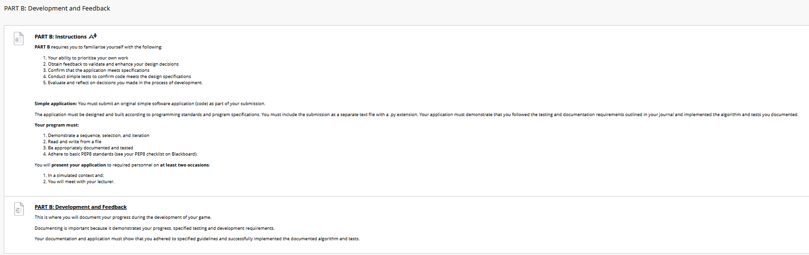

## Instructions
*Assignment due ???*  
Instructions from blackboard for quick reference:
___

[Assessment link](https://blackboard.northmetrotafe.wa.edu.au/webapps/blackboard/content/listContent.jsp?course_id=_41920_1&content_id=_4709871_1)  

**Due Dates Note:**  
ICTPRG302 runs at double speed for Certificate IV in Information Technology (Programming):  

**Instructions:**

[Link to Devlopment and Feedback Questions](https://blackboard.northmetrotafe.wa.edu.au/webapps/assessment/review/review.jsp?attempt_id=_10014020_1&course_id=_41920_1&content_id=_4718737_1&outcome_id=_8041944_1&outcome_definition_id=_2119564_1&takeTestContentId=_4718737_1)  
[Link to Questions Submission](./part-b-test-submission.md)  
