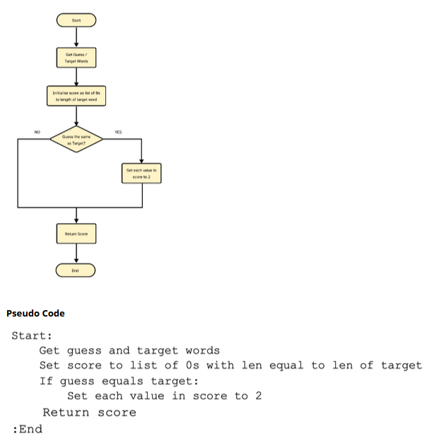
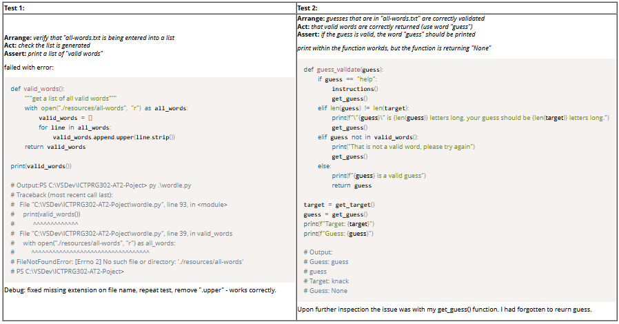

# AT2 Project: Part B submission

[link](https://blackboard.northmetrotafe.wa.edu.au/webapps/assessment/take/launch.jsp?course_assessment_id=_152942_1&course_id=_41920_1&content_id=_4718737_1&step=null)

Contents:
- [AT2 Project: Part B submission](#at2-project-part-b-submission)
  - [Instructions](#instructions)
    - [Question 1](#question-1)
    - [Question 2](#question-2)
    - [Question 3](#question-3)
    - [Question 4](#question-4)
    - [Question 5](#question-5)
    - [Question 6](#question-6)
    - [Question 7](#question-7)
    - [Question 8](#question-8)
    - [Question 9](#question-9)
    - [Question 10](#question-10)
    - [Question 11](#question-11)
    - [Question 12](#question-12)
    - [Question 13](#question-13)
    - [Question 14](#question-14)
    - [Question 15](#question-15)
    - [Question 16](#question-16)

___

## Instructions 	
This journal is for documenting your progress during the development of your game.

It is important because it documents your specified testing and development requirements. Your journal and application must show that you adhered to specified guidelines and successfully implemented the documented algorithm and tests. 	

**Answering Questions:**  
You must attempt to answer ALL questions.  

A word count is sometimes given, but most answers require at most 1-3 paragraphs. All answers must be in complete sentences unless indicated. You must use your own words unless otherwise specified.

___
### Question 1
Needs Marking  
Unmarked 	

**Below is a list of requirements for the application.**

Your task is to match each requirement with the appropriate answer that includes:
* the Python function  
* selection statement  
* iteration statement, or;  
* sequence of statements.  
Refer to the instructions in the video to help you with your answer.

Selected Answer: 	
|  Task   |   Instruction   |
|---------|-----------------|
| Present game instructions to player (That is, display an output to the screen). | G. The senior developer emphasized that the game must include instructions that apppear the first time the user plays the game and can be accessed any time by entering “HELP” in any case. The developer said I should use a print function for each line. |
| Use a sequential algorithm to read a list of valid words and a separate list of target words. | D. Python allows you to access the file sequentially by first opening each file and then iterating over the lines in the file. Since the files are formatted to have a new word on each line I just need to remove whitespaces. |
| Select a word at random from the list of target words using a library function (refer to the developer briefing for the exact syntax). | A. The senior developer showed me a library function called random, first I import random and then I can use random.choice on the list to pick a target word at random. |
| Prompt the user to enter a guess. | B. I will use an input function and then assign the result to a variable. |
| Check if the guess that is entered is a valid guess. | E. For a guess to be considered valid it must (a) check the word length and (b) check that the word the user chosen is a real word (valid) by checking if it is in the list of words generated earlier. I will need to use and if/else statement (i.e. a selection), with a while loop. |
| Score the guess by providing clues on each character’s match to the target word’s characters. | C. I need to iterate over each character in the word (for loop) and then check if the word is in the target. |
| End the game when the player wins or when all valid attempts are complete. | H. If the user runs out of tries, then the loop breaks out automatically (if it is a for when you run out of tries, if it is a while by checking the number of turns each time) but if they win that’s when I need to break out of the loop. I would use a break statement. | 
| Present a completion message to the user. | F. I will have a sequence of print statements. Each with its own line of the completion message. |

Response Feedback: 	[None Given]  

___
### Question 2
Needs Marking  
Unmarked 

**During your discussion, the senior developer provided you with a flowchart and pseudo code below:**   
  

The developer explained that a big focus of your work is your ability to come up with a simple algorithm that will allow you to score individual guesses using the rules of the Wordle game.  

**In the next few sections, you will:**  
* Iteratively (in stages) code a function that will provide a score for the individual characters of guess following a testing methodology
* Determince if characters in a guess are in the target word and if they are in the correct position.

*****NOTE:** You don’t have to worry about how to score repeated characters, but you can if you want to.  

**To do:**  
1. Write a function called **score guess** that matches the **flowchart** and **pseudo code** above  
2. Your function must demonstrate the correct application of syntax rules and variable scopes
3. The function must accept the guess and target words as arguments
4. Upload a screenshot of your code, demonstrating the correct application of syntax rules and variable scopes (the function must accept the guess and target words as parameters).

*****NOTE:** You must include your name, student number and date as a comment above your code.  

Selected Answer: 	
```python
# 28-March-2025

def score_guess(guess, target):
    score = [0,0,0,0,0]
    if guess == target:
        score = [2,2,2,2,2]
        return score
```
Response Feedback: 	[None Given]

___
### Question 3
Needs Marking  
Unmarked 	

Write a **function called score_guess** that matches the algorithm.  

**Test case 1:**  
**Arrange:** Set the guess word to **world** and the target word to **world**  
**Act:** Call score_guess with guess, target  
**Assert:** Returns [2, 2, 2, 2, 2]  

**To do:**  
1. Write a function called **score guess** that matches the **test case** above
2. Your function must demonstrate the correct application of syntax rules and variable scopes
3. The function must accept the guess and target words as arguments
4. Upload a screenshot of your code
5. The screenshot must demonstrate the correct application of syntax rules and variable scopes (the function must accept the guess and target words as parameters).

*****NOTE:** You must include your name, student number and date as a comment at the top of your code.

Selected Answer: 	
```python
# 28-March-2025

def score_guess(guess, target):
    score = (0,0,0,0,0)
    if guess == target:
        score = (2,2,2,2,2)
        return score
    else:
        return score

guess = "world"
target = "world"

print(score_guess(guess, target))
```
```
Console Output:

PS C:\Gitstuff> py .\test.py 
(2, 2, 2, 2, 2)
PS C:\Gitstuff> 
```

Response Feedback: 	[None Given]

___
### Question 4
Needs Marking  
Unmarked 	

Write a **function called score_guess** that matches the algorithm.  
**Test case 2:**  
**Arrange:** Set the guess word to world and the target word to hello  
**Act:** Call score_guess with guess, target  
**Assert:** Returns [0, 0, 0, 0, 0]  

**To do:**  
1. Write a function called score guess that matches the test case above
2. Your function must demonstrate the correct application of syntax rules and variable scopes
3. The function must accept the guess and target words as arguments
4. Upload a screenshot of your code
5. The screenshot must demonstrate the correct application of syntax rules and variable scopes (the function must accept the guess and target words as parameters).

*****NOTE:** You must include your name, student number and date as a comment above your code.

Selected Answer: 	
```python
# 28-March-2025

def score_guess(guess, target):
    score = (0,0,0,0,0)
    if guess == target:
        score = (2,2,2,2,2)
        return score
    else:
        return score

guess = "world"
target = "hello"

print(score_guess(guess, target))
```
```
 Console Output:

PS C:\Gitstuff> py .\test.py
(0, 0, 0, 0, 0)
PS C:\Gitstuff> 
```

Response Feedback: 	[None Given]

___
### Question 5
Needs Marking  
Unmarked 	

Now that you have done the basics, it is time to develop an algorithm for **scoring each character in a guess** rather than the whole word as we did previously.  

**Please complete the following:**  
* Develop the scoring algorithm as either pseudocode or a flowchart
* Your code must pass the tests.
* Upload your flowchart or pseudocode of your algorithm, demonstrating the scoring of the individual characters of a guess. 

*****Note:** You must include your name, student number and date as a comment at the top of your code.

Selected Answer: 	
```python
# 28-March-2025

# Pseudocode: score each letter

for guess_letter in guess
   if guess_letter in target # Use find (will return the first index)
        return target_index
        increment score by 1

    if target_index == guess_letter index
        increment score by 1
```
Response Feedback: 	[None Given]

___
### Question 6
Needs Marking  
Unmarked 	

Write a **function called score_guess** that matches the algorithm.  

**Test case 1:**  
**Arrange:** Set the guess word to **world** and the target word to **world**  
**Act:** Call score_guess with guess, target  
**Assert:** Returns [2, 2, 2, 2, 2]  

**To do:**  
1. Write a function called **score guess** that matches the **test case** above
2. Your function must demonstrate the correct application of syntax rules and variable scopes
3. The function must accept the guess and target words as arguments
4. Upload a screenshot of your code
5. The screenshot must demonstrate the correct application of syntax rules and variable scopes (the function must accept the guess and target words as parameters).

*****Note:** You must include your name, student number and date as a comment above your code.

Selected Answer: 	
```python
# 28-March-2025

def score_guess(guess, target):
    score = [0,0,0,0,0]
    for i in range(len(guess)):
        letter_score = target.find(guess[i])
        if letter_score >= 0:
            score[i] += 1
            if guess[i] == target[i]:
                score[i] += 1
    return tuple(score) # Just for DevRaf!

guess = "world"
target = "world"

print(score_guess(guess, target))
```
```
Console Output:

PS C:\Gitstuff> py .\test.py
(2, 2, 2, 2, 2)
PS C:\Gitstuff> 
```

Response Feedback: 	[None Given]

___
### Question 7
Needs Marking  
Unmarked 	

Write a function called score_guess that matches the algorithm.

**Test case 2:**  
**Arrange:** Set the guess word to **world** and the target word to **hello**  
**Act:** Call score_guess with guess, target  
**Assert:** Returns [0, 1, 0, 2, 0]  


**To do:**
1. Write a function called score guess that matches the test case above
2. Your function must demonstrate the correct application of syntax rules and variable scopes.
3. The function must accept the guess and target words as arguments
4. Upload a screenshot of your code
5. The screenshot must demonstrate the correct application of syntax rules and variable scopes (the function must accept the guess and target words as parameters).

*****NOTE:** You must include your name, student number and date as a comment above your code

Selected Answer: 	
```python
# 28-March-2025

def score_guess(guess, target):
    score = [0,0,0,0,0]
    for i in range(len(guess)):
        letter_score = target.find(guess[i])
        if letter_score >= 0:
            score[i] += 1
            if guess[i] == target[i]:
                score[i] += 1
    return tuple(score) # Just for DevRaf!

guess = "world"
target = "hello"

print(score_guess(guess, target))
```
```
print(score_guess(guess, target))

Console Output:

PS C:\Gitstuff> py .\test.py
(0, 1, 0, 2, 0)
PS C:\Gitstuff>
```

Response Feedback: 	[None Given]

___
### Question 8
Needs Marking  
Unmarked 	

**Demonstrate how you would clarify the meaning of the code using:**  
* docstrings and;
* commenting techniques.

Since scoring a guess correctly was a key part of the project, you need to ensure you **document your work.** Include a **docstring in the code** that briefly explains what the function does, its parameters, and the value it returns.

**To do:**
1. Write a docstring within your code
2. Upload a screenshot of your code
3. The screenshot must demonstrate the correct application of syntax rules and variable scopes (the function must accept the guess and target words as parameters).

*****Note:** You must include your name, student number and date as a comment at the top of your code.

Selected Answer: 	
```python
"""
Implementation of the game "Wordle"
Designed to run in a CLI environment
"""
# 28-March-2025

def score_guess(guess, target):
    """Score guesses by letter, +1 to score for a letter in guess being in the target word, +1 for the letter being in the correct location."""
    score = [0,0,0,0,0]
    for i in range(len(guess)):
        letter_score = target.find(guess[i])
        if letter_score >= 0:
            score[i] += 1
            if guess[i] == target[i]:
                score[i] += 1
    return tuple(score) # Just for DevRaf!

guess = "world"
target = "hello"

print(score_guess(guess, target))
```
```
Console Output:

PS C:\Gitstuff> py .\test.py
(0, 1, 0, 2, 0)
PS C:\Gitstuff> 
```

Response Feedback: 	[None Given]

___
### Question 9
Needs Marking  
Unmarked 	

It is now time to read the **valid words** and **target words** from their respective file.
* Implement this functionality in your code
* Confirm that the **variables** were **read correctly**
* Use **debugging techniques** to inspect the contents of the variable.

**To do:**  
1. Open the file and read the file content.
2. Split the content into words, making sure content is split into individual words.
3. Remove any surrounding whitespace and store the words in a list. The result will be a list where each item is a word without any surrounding whitespace.
4. You can inspect the variable by either using a debugger or using print statements.
5. Upload a screenshot of your code.

*****Note:** You must include your name, student number and date as a comment at the top of your code.

Selected Answer: 
```python
# 28-March-2025

with open("./resources/target-words.txt", "r") as target_list:
    target = []
    for line in target_list:
        target.append(line.strip())
    print(target)

with open("./resources/all-words.txt", "r") as all_list:
    all_words = []
    for line in all_list:
        all_words.append(line.strip())
    print(all_words)
```
Response Feedback: 	[None Given]

___
### Question 10
Needs Marking  
Unmarked 	

**Debugging:**  
To do:
* Inspect the **first five (5)** and **last five words (5)** in each list
* Confirm that the lists were read correctly
* Upload a screenshot of your output.

Selected Answer: 	

```python
with open("./resources/target-words.txt", "r") as target_list:
    target = []
    for line in target_list:
        target.append(line.strip())
    print(f"First 5 words of target-words.txt:\n {target[:5]}")
    print(f"Last 5 words of target-words.txt:\n {target[-5 : len(target)]}\n")

with open("./resources/all-words.txt", "r") as all_list:
    all_words = []
    for line in all_list:
        all_words.append(line.strip())
    print(f"First 5 words of all-words.txt:\n {all_words[:5]}")
    print(f"Last 5 words of all-words.txt:\n {all_words[-5 : len(all_words)]}")
```
```
Console Output:

PS C:\Gitstuff> py .\test.py
First 5 words of target-words.txt:
 ['aback', 'abase', 'abate', 'abbey', 'abbot']
Last 5 words of target-words.txt:
 ['young', 'youth', 'zebra', 'zesty', 'zonal']

First 5 words of all-words.txt:
 ['aahed', 'aalii', 'aargh', 'aarti', 'abaca']
Last 5 words of all-words.txt:
 ['zuzim', 'zygal', 'zygon', 'zymes', 'zymic']
PS C:\Gitstuff>
```

Response Feedback: 	[None Given]  

___
### Question 11
Needs Marking  
Unmarked 	

**Code the remaining requirements**
1. You must document a test case
2. Upload a screenshot to demonstrate that it ran successfully

**Debugging can involve any of the following:**  
* Adding print statements to better understand your code’s execution
* Using an interactive debugger
* Reasoning about your code and the errors it produces.

**Test 1:**  
**Act:** *\<setup of the test>*  
**Arrange:** *\<what you are testing>*  
**Assert:** *\<what are the expected results>*  

**To do:**  
* Upload a screenshot of your output demonstrating you **completed TEST 1** successfully.

Selected Answer:  
**Act:**  test get_target() function  
**Arrange:**  test that the function returns a random word from target-list.txt  
**Assert:** should return a different random upper case word each time the program is run  
```python
def get_target():
    with open("./resources/target-words.txt", "r") as target_list:
        target_words = []
        for line in target_list:
            target_words.append(line.strip())
        target = str.upper(random.choice(target_words))
        return target

target = get_target()
print(target)
```
```
Console Output::

PS C:\VSDev\ICTPRG302-AT2-Poject> py .\wordle.py
ADORE
PS C:\VSDev\ICTPRG302-AT2-Poject> py .\wordle.py
TRIAD
PS C:\VSDev\ICTPRG302-AT2-Poject> py .\wordle.py
COWER
```
Response Feedback: 	[None Given]  

___
### Question 12
Needs Marking  
Unmarked 	

**Code the remaining requirements**
1. You must document a test case
2. Upload a screenshot to demonstrate that it ran successfully

**Debugging can involve any of the following:**  
* Adding print statements to better understand your code’s execution
* Using an interactive debugger
* Reasoning about your code and the errors it produces.

**Test 1:**  
**Act:** *\<setup of the test>*  
**Arrange:** *\<what you are testing>*  
**Assert:** *\<what are the expected results>*  

**To do:**  
* Upload a screenshot of your output demonstrating you **completed TEST 2** successfully.

Selected Answer:  
**Act:**  test guess_validate() function  
**Arrange:**  check the length of the words "two" and "words"  
**Assert:** should prompt for new guess if guess is two, should print "Your guess is the correct length" for "words"  
```python
def get_guess():
    """get a user guess"""
    guess = str.upper(input("Please guess a 5-letter word\nOr type \"help\" to review the instructions\nGuess: "))
    guess_validate(guess)

def guess_validate(guess):
    if len(guess) != len(target):
        print(f"{guess} is {len(guess)} letters long, your guess should be {len(target)} letters long.")
        get_guess()
    else:
        print("Your guess is the correct length")
    return guess
    
print(get_guess())
```
```
Console Output:

PS C:\Gitstuff> py .\test.py
Please guess a 5-letter word
Or type "help" to review the instructions
Guess: two
TWO is 3 letters long, your guess should be 5 letters long.
Please guess a 5-letter word
Or type "help" to review the instructions
Guess: words
Your guess is the correct length
```
Response Feedback: 	[None Given]  

___
### Question 13
Needs Marking  
Unmarked 	

**Debugging for Test 1 and Test 2:**  
* Describe the occasions (at least 2) where you had to debug your code and then the debugging process you followed
* Capture your output with screenshots.

**Debugging can involve any of the following:**  
1. Adding print statements to understand your code’s execution better
2. Using an interactive debugger
3. Reasoning about your code and the errors it produces.


| Test 1:                                   | Test 2:                                   |
|-------------------------------------------|-------------------------------------------|
| Arrange: *\<setup of the test>*           | Arrange: *\<setup of the test>*           |
| Act: *\<what are you testing>*            | Act: *\<what are you testing>*            |
| Assert: *\<what is the expected results>* | Assert: *\<what is the expected results>* |


Selected Answer: 	


Response Feedback: 	[None Given]  

___
### Question 14
Needs Marking  
Unmarked 	

**DO NOT COMPLETE THIS SECTION WITHOUT YOUR LECTURER**  
* Discuss and review your code with the senior developer (lecturer)
* Write and document any changes you need to make before acceptance
* You must complete all previous sections in Part B in readiness for this review
* Provide evidence that you have tested and documented your project.

**To do:**
1. List any changes (if any) that you committed to make to your code style because it did not conform to coding standards.

Selected Answer:  
Senior Developer feedback:
* Standardise function names so they are consistent and follow a verb-phrase style.
* Update docstrings so they are consistent in style (with new-lines), also remove references to file names.
* Combine the "get_target()" and "valid_words()" functions into a single read-file function.

Additional "nice to have" Senior Dev feedback:
* Improve modularity so that words of any length can be used, avoiding magic numbers.
* Avoid the use of exit() statements.
* Make the game loop a function.

Client feedback:  
* Improve readability by adding line breaks after the score is displayed.
* Add the ability to play again.
* Save the number of attempts to a file.
* When a game is won, show the number of attempts made, as well as the average number of attempts.

Response Feedback: 	[None Given]  

___
### Question 15
Needs Marking  
Unmarked 	

**DO NOT COMPLETE THIS SECTION WITHOUT YOUR LECTURER**  
* Discuss and review your code with the senior developer (lecturer)
* Write and document any changes you need to make before acceptance
* You must complete all previous sections in Part B in readiness for this review
* Provide evidence that you have tested and documented your project.

**To do:**  
1. List any changes that occurred because you failed to meet one or more of the requirements
2. Explain what steps could have been taken to identify such issues earlier in the project.
3. If no such changes were found, highlight what clarifying steps you took earlier in the project to ensure your success.

Selected Answer:  	
1. Some function names did not adhere to PEP 8 standards.
2. I should have reveiwed those prior to submitting the code.
3. Overall, most of the feedback was about efficiency and adding polish (and much appreciuated). I fulfilled all other basic requirements as set out in the brief

Response Feedback: 	[None Given]  

___
### Question 16
Needs Marking  
Unmarked 	

Confirm that your code has been **reviewed** and **fill in the details below**.

I, ***\<your full name>***, confirm that this code has been reviewed by ***\<lecturer>*** on ***\<date>***.

Your Lecturer will check that you have made the agreed changes during the discussion and review.

Selected Answer: 	

```
I confirm that this code has been reviewed by Rafael Avigad on 8/4/2025.
```
Response Feedback: 	[None Given]  
