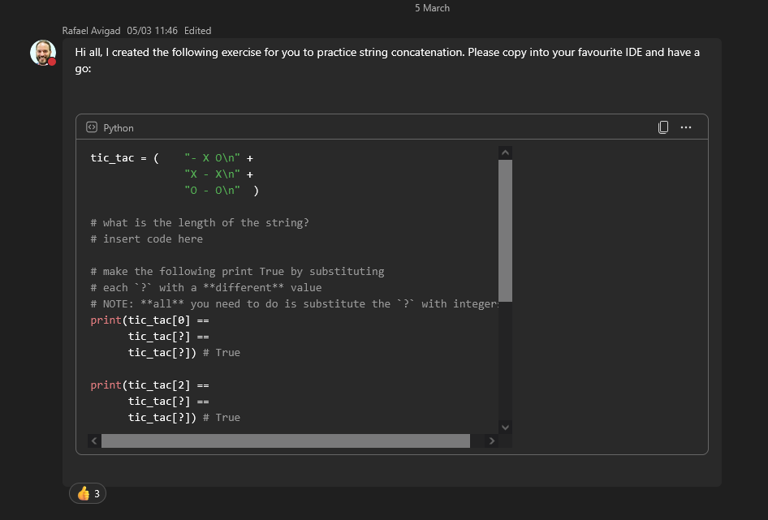
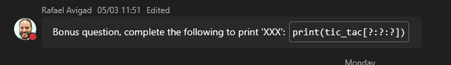

# Contents
- [Contents](#contents)
- [Week 4/Session 6 - Strings and String Manipulation](#week-4session-6---strings-and-string-manipulation)
    - [Strings!](#strings)
    - [Cleaning input](#cleaning-input)
  - [Fstrings!!](#fstrings)
  - [Resources](#resources)
  - [Activities](#activities)


# Week 4/Session 6 - Strings and String Manipulation
In this session, we're going to discover the fascinating world of Strings and String Manipulation in Python.  

Strings are a fundamental data type used to represent text, and you'll learn how to create, modify, and manipulate strings using various techniques and functions.  

**This session will provide you with the skills and knowledge required to:**  
* 2.2 Create code using language data types, operators, and expressions: Understand and use string data types, and apply operators and expressions to manipulate strings
* 4.4 Apply string manipulation: Perform various string operations such as slicing, concatenation, and formatting to process and modify text data
* 5.1 Examine variable contents and use debugging techniques to detect and correct errors: Debug and troubleshoot string manipulation code for accuracy and efficiency.

By the end of this session, you'll be able to handle strings confidently and use them to solve a wide range of programming problems.  

**Session 6 Overview**  
At the end of this session, you should be able to:  
* Understand the basics of Python strings
* Perform simple string operations
* Concatenate (join) strings using the + operator
* Use indexing and slicing to access individual characters
* Strip whitespace from the beginning and end of strings
* Discover how to format strings.

### Strings!
Strings a simple type of collection

```py
x = "Monty Python"
```

index notation is a way of accessing elements of a string by their position, starting at 0.  
`x[0]`  
`len(x)`  

negative indexing:  
`[::-1]` useful for reversing strings.
```py
x = "Monty Python"
print(x.capitalize())
print(dir(x))
```

The attributes of a string are length and encoding,

**Stings are objects**, they have attributes (things that matter about them) and methods (things that can be done to them).

find returns -1 if nothing is found.

find returns the first occurnece, unless you specify the next, `x index(n, 2)`

activity:  
Write a funtion that takes an e-mail and returns the domain  
using index or find and slicing.  
```python
# Write a funtion that takes an e-mail and returns the domain
# using index or find and slicing.

#def get_domian(email):
#    x = email[email.find('@')+1 :]
#    return x

# OR

def get_domian(email):
    return email[email.find('@')+1 :]

print(get_domian('rafael.avigad@mntafe.wa.edu.au'))
```

### Cleaning input
parse input to clean it eg:
```py
answer = input("continue y/n: ").lower().strip()  
```
Cand also `answer.startswith('ye')`  
lstrip() and rstrip() learn about (left and right whitespace strip).

## Fstrings!!
```py
def calculate_tax(income):
    return 0.3 * income

income = 50_000
# print("given your income you owe" + str(calculate_tax(50_000) ...) ewww
print(f"your income is {income}, which means you owe {income * 0.3} in taxes")
```


## Resources
***Functions***  
[Lecture Slides](./resources/ICTPRG302-S6-Strings.pptx)  

## Activities
***Functions***  
[Activity 1: String Magic](./activities/string-magic.md)  
[Activity 1: Complete](./activities/string-magic.py) 

Activity from raf:  
[Tic Tac Excercise](activities/tic_tac.md)  
[Tic Tac Complete](activities/tic_tac.md)  
  

