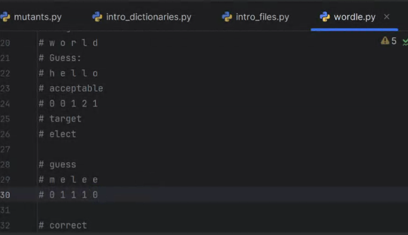
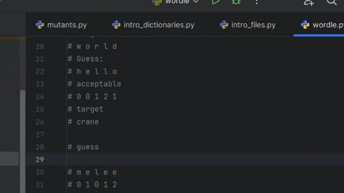
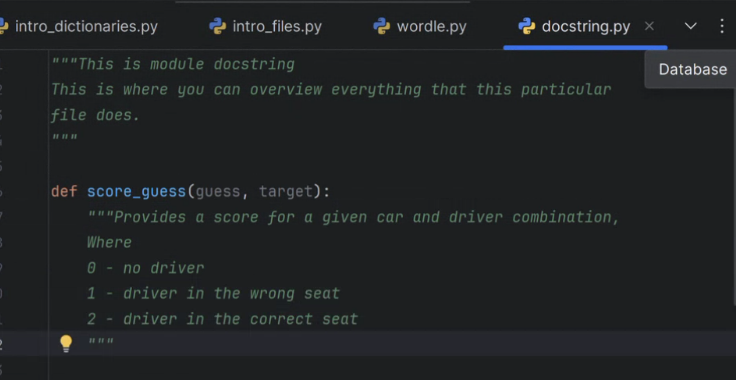

# Contents
- [Contents](#contents)
- [Week 7 Assignment Information](#week-7-assignment-information)


# Week 7 Assignment Information
*AT2-Project: Part A*  
  
this week: complete part A, create score guess function. (ignore duplicates for version 1).

Questions today... learning about part A (already submitted).

* Show active listening.


answer first 4 after CEO briefing (done)
Then for Q 5 watch dev video.
Then make something (anything)

Don't wait for CEO response, assume. (Developer vid is up now.)

All words text file contains EVERYTHING
valid words are actual words.

This is to narrow the words down to "common" words, not all actual words, all words is NOT all combinations of letters.

valid words are the ones in all words, target words are the ones in target words.

Do your best with Q 5

5: how did answers in second video inform or answer your questions (if not why not).

6: I <name> have been able to locate and access each of the files on <date>.


*AT2-Project: Part B*  
See algorithm... but also don't code it.

SEE Part B first.

1. should be easy, do it early (good start to the actual code, shows features)
2. then there's a flowchart, video also helps, use the flowchart or the pseudocode (you can uplaod the code), but don't do more than that.
    ```python
    def score_guess(guess, target):
        SET SCORE TO ALL ZEROES (BASED ON LEN)
        if guess same as target
        set score to 2,2,2,2,2
        return score
        if correct
            return (2,2,2,2,2)
    ```
    Don't overdo it  
3. create a test case to validate
    ```python
        guess = "world"
        print(guess)
        target = "world"
        print(target)
        print(got: score_guess(world, target))
    ```
    doesn't have to be actual screenshots

    **THEN develop the full scoring algrithm  
    code or flowchart**
4. How you split the word, how you find the correcsponding in the target, and how you determine 0, 1, 2

challenge excercise:
if taget is "hello" and guess is "world", what happens if it's flipped., and what happens with double letters.

hello should be 0, 0, 0, 2, 1... l is not doubled in world... need to catch that (ideally). melee vs elect... third e woudl be 0





5. add documentation ot code minimally using docstrings include comment and a docstring.
    docstings are a multiline string that acts as a comment
    ```python
    welcome = """Hello
    How are You?
    What are you up to?"""
    ```
module docstring is one at the top of a file and documents everything it does, adn can also include comments has to be at the top.

function docstrings go under functions (must be indenterd)


IDE knows to use the doctring to provide help, as does python.

Use comments as little as possible, code should be self evident.

Difference between a commmetn and a docstring , comment is targeted at someone reading code, docstring targeted at someone using the code, can re-use functions!!!!

Debug using first/last. or debug button.

`target = random.choice(target_words)`
