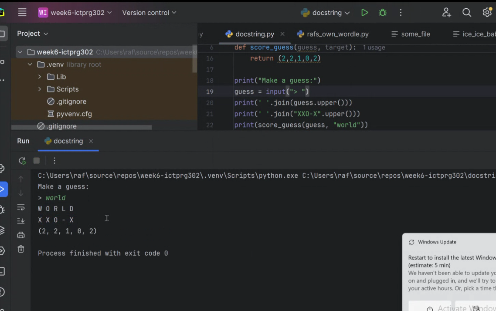
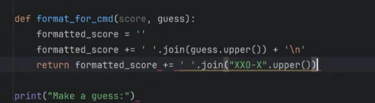
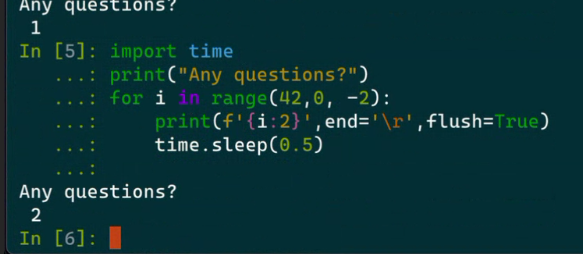

# Contents
- [Contents](#contents)
- [Week 8 Assignment Information](#week-8-assignment-information)
  - [Doctests](#doctests)


# Week 8 Assignment Information
*AT2-Project: Part B*

should be mostly finished part B (or by next week.)
Officially Due week 2 next term, but aim for faster.

No session next week - might use the time to collective code review. 8 people, optional.

Spreadsheet will go up for one-on-one time.

Question 10:  
use print statements

Question 11:  
document test cases - for example enter a word that is only 4 characters, show ouutput of error.  
manual test is fine.  
don't do what is in the question, create one.  


You know it's ready for review whyen everything from Question 1 is complete.  
Write notes when there are problems.  
We will get feedback, and WILL need to make changes, and will be proportional to code qusality - the better the code, the harder the changes.  

Part C fill out word doc will get final sign off.

as long as the final changes from the part B review are done, you're done.  

use symbols for output:




print(*score_guess(guess, "world"))

unpacks argument (or gathers them if used in a fuction)
args and kwargs

** in a dictionary, _ will unpack keys.
end='\r' prints in place!!!!




## Doctests
Doctests were initially a mechanism in python for testing out documentation. It can be used to test that something returns what it should

```python
def score_guess(guess, target): # Example function with documentation
    """
    This function returns clues for a game of wordle.
    args: 
        guess - some guess
        taget - some target
    
    Example:
    score_guess('hello', 'world')
    (0,0,1,2,1)
    """
    return (0,0,1,2,1) # Pretend there is actually logic that does this

assert score_guess('hello', 'world') == (0,0,1,2,1) 
```
This will run with exit code 0, i.e. no error/test passed.
If the test or function failedd, then an "assertion error" will be produced, indicating that the function did not work correctly (or the assertion is wrong).

for example if the `score_guess()` function above is update to properly handle extra letters (i.e. should return (0,0,0,2,1)) and the assertion is not changed then there will be an assertion error.

The docstring also needs updating, documentation is part of the code. This would cause the user to raise it as a bug.

Doctest can be used to test assertions in the documentation of a function, which can be handy, the `>>>` is the only active element that can be used in a docstring.

```python
import doctest
def score_guess(guess, target): # Example function with documentation
    """
    This funtion returns clues for a game of wordle.
    args: 
        guess - some guess
        taget - some target
    
    Example:
    >>> score_guess('hello', 'world')
    (0,0,1,2,1)
    >>> score_guess('hello', 'hello')
    (2,2,2,2,2)
    """
    return (0,0,0,2,1) # Pretend there is actually logic that does this

doctest.testmod()
```
This is an easy way to run tests, Pycharm will do this without importing doctest, but any editor will work with the doctest moudule imported.

Will Output:
```
**********************************************************************
File "C:\Users\me\AppData\Local\Temp\temp_1744776000262.py", line 12, in __main__.score_guess
Failed example:
    score_guess('hello', 'world')
Expected:
    (0,0,1,2,1)
Got:
    (0, 0, 0, 2, 1)
**********************************************************************
File "C:\Users\me\AppData\Local\Temp\temp_1744776000262.py", line 14, in __main__.score_guess
Failed example:
    score_guess('hello', 'hello')
Expected:
    (2,2,2,2,2)
Got:
    (0, 0, 0, 2, 1)
**********************************************************************
1 items had failures:
   2 of   2 in __main__.score_guess
***Test Failed*** 2 failures.
```
It is accepted to import doctest within a fuction, however in all other cases imports are done at the top of the code.

