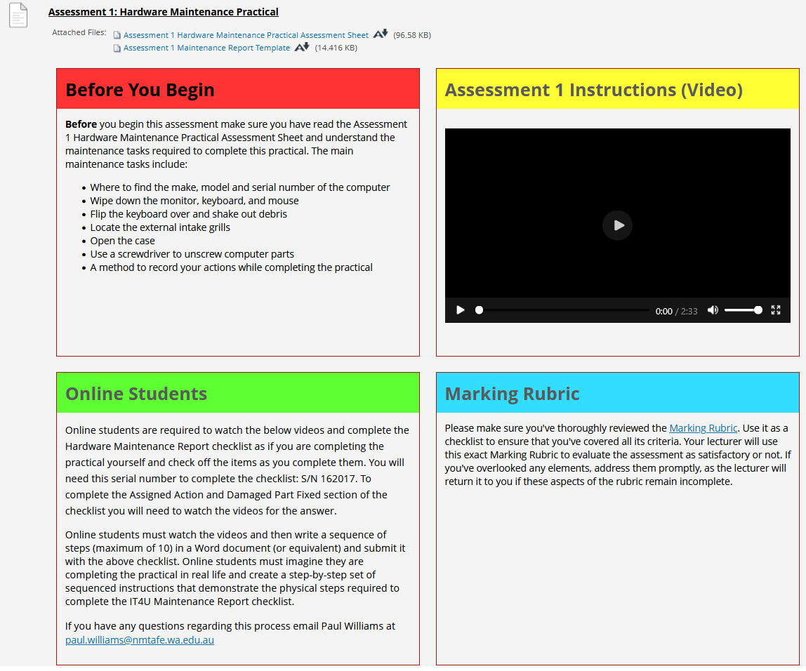

## Instructions
*Assignment due 28/3/2025*  **submitted 21/2/2025**  
Instructions from blackboard for quick reference:
___

[Assessment link](https://blackboard.northmetrotafe.wa.edu.au/webapps/assignment/uploadAssignment?content_id=_2943954_1&course_id=_31151_1&group_id=&mode=view)  

**Instructions:**



* [Link](https://blackboard.northmetrotafe.wa.edu.au/ultra/courses/_31151_1/cl/outline)  to videos
* [Assessment 1 Hardware Maintenance Practical Assessment Sheet](./resources/ICTSAS432-Software-FT-N-Ass1.docx)
* [Assessment 1 Maintenance Report Template](./resources/Ass1-ITU4-Maintenance-Report.docx)

### Assignment Notes:
* [Completed Sequence Steps](./Assessment_1-Sequence-Steps-Amanda-Guest.docx)
* [Maintenance Report](./Ass1-ITU4-Maintenance-Report-Complete.docx)  

### Feedback
```
Client 

I confirm that this maintenance job was completed successfully. 

Lecturer 

Task 1: Verified all necessary equipment was present to complete the job. 

Task 2: Executed maintenance tasks as per the IT4U Maintenance Report checklist. 

Task 3: Signed and submitted the Maintenance Report for client approval. 

The procedure has been outlined clearly. Your comprehension of the maintenance process was successfully demonstrated. 

pw
```