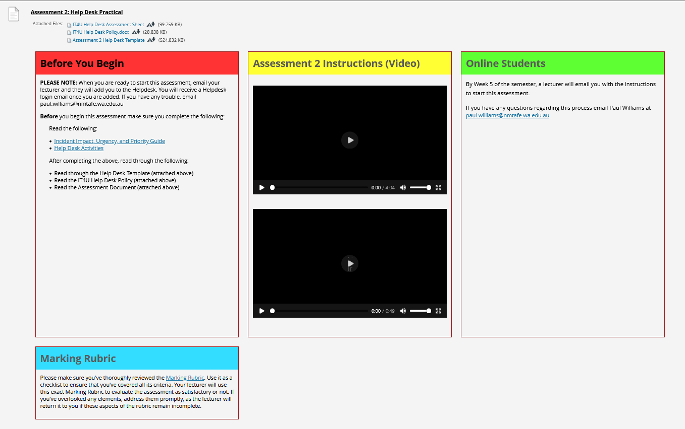

## Instructions
*Assignment due 4/4/2025*  **submitted 19/3/2025**  
Instructions from blackboard for quick reference:
___

[Assessment link](https://blackboard.northmetrotafe.wa.edu.au/webapps/assignment/uploadAssignment?content_id=_2944021_1&course_id=_31151_1&group_id=&mode=view)  

**Instructions:**

* [Link](https://blackboard.northmetrotafe.wa.edu.au/ultra/courses/_31151_1/cl/outline)  to videos
* [IT4U Help Desk Assessment Sheet](./resources/ICTSAS432-Software-FT-N-Ass2.docx)
* [IT4U Help Desk Policy.docx](./resources/IT4U-Help-Desk-Policy.docx)
* [Assessment 2 Help Desk Template](./resources/Ass2-Help-Desk-Template.docx)
* [Incident Impact, Urgency, and Priority Guide](https://berkeley.service-now.com/kb_view.do?sysparm_article=KB0010891)
* [Help desk Activities](https://blackboard.northmetrotafe.wa.edu.au/webapps/blackboard/content/listContentEditable.jsp?content_id=_2941431_1&course_id=_31151_1) link to online
  * [Completed Test - Help Desk Skills](../test-4-help-desk-skills/test-4-submission.md) 
* [Help Desk Link](https://helponc4.screencraft.net.au/)

### Assignment Notes:
* [Completed Sequence Steps](./Ass2-Help-Desk-Template-Amanda-Guest.docx)

### Feedback
> Your assessment was completed well for both the software and hardware sections. For the software part, you effectively communicated your solutions with detailed screenshots. Your thorough investigation into the fault and the replacement process was well articulated in the hardware section. Overall, your work highlights excellent client liaising skills.  
pw  