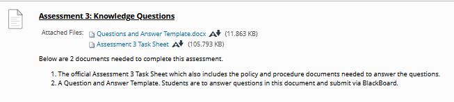

## Instructions
*Assignment due 11/4/2025*  **submitted 12/3/2025**  
Instructions from blackboard for quick reference:
___

[Assessment link](https://blackboard.northmetrotafe.wa.edu.au/webapps/assignment/uploadAssignment?content_id=_4065257_1&course_id=_31151_1&group_id=&mode=view)  

**Instructions:**

* [Questions and Answer Template](./resources/Questions-and-Answer-Template.docx)
* [Assessment 3 Task Sheet](./resources/ICTSAS432-Software-FT-N-Ass3.docx)

### Assignment Notes:

### Feedback
> Your accurate responses to all the questions demonstrate a solid understanding and knowledge of the subject matter. Your analysis of IT4U’s policies and procedures showcases your awareness of operational standards and sustainability efforts. Well done!   
pw