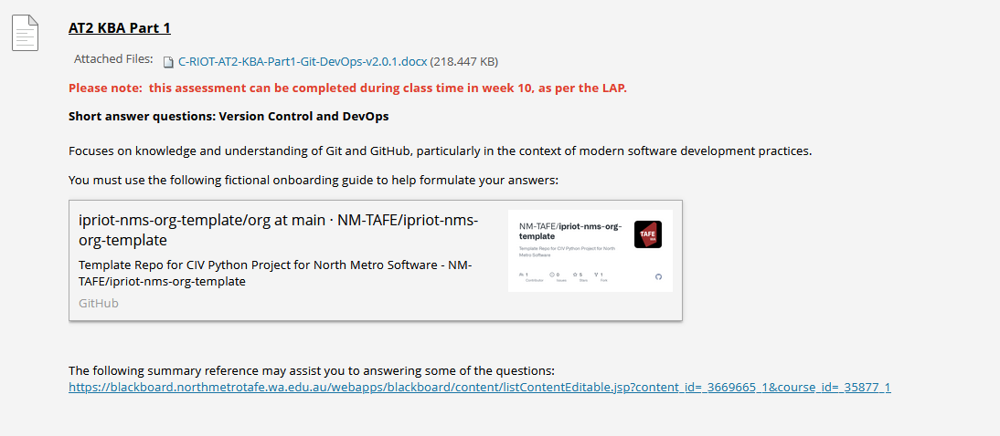

## Instructions
*Assignment due 11/4/2025* - **Completed 8/4/2025**  
Instructions from blackboard for quick reference:
___

[Assessment link](https://blackboard.northmetrotafe.wa.edu.au/webapps/assignment/uploadAssignment?content_id=_3663744_1&course_id=_35877_1&group_id=&mode=view)

  

* [C-RIOT-AT2-KBA-Part1-Git-DevOps-v2.0.1.docx](./resources/C-RIOT-AT2-KBA-Part1-Git-DevOps-v2.0.1.docx)  
* [ip4riot-nms-template - github link](https://github.com/NM-TAFE/ipriot-nms-org-template/tree/main/org)  
* [summary reference may assist](https://blackboard.northmetrotafe.wa.edu.au/webapps/blackboard/content/listContentEditable.jsp?content_id=_3669665_1&course_id=_35877_1)  

### Assignment Notes:
Short answer questions about version control and DevOps.  
