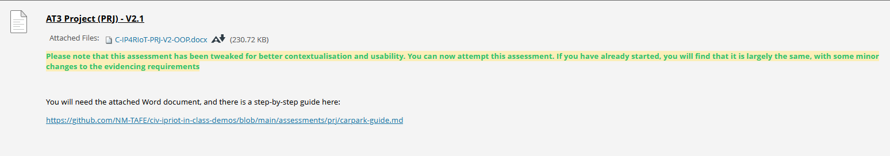

## Instructions
*Assignment due 20/6/2025*  
**Submitted 27/6/2025**  
Instructions from blackboard for quick reference:
___

[Assessment link](https://blackboard.northmetrotafe.wa.edu.au/webapps/assignment/uploadAssignment?content_id=_3928747_1&course_id=_35877_1&group_id=&mode=view)

* [C-IP4RIoT-PRJ-V2-OOP.docx](./resources/C-IP4RIoT-PRJ-V2-OOP.docx)  
* [Object-Oriented Programming - Car Park System - github link](https://github.com/NM-TAFE/civ-ipriot-in-class-demos/blob/main/assessments/prj/carpark-guide.md)  

* [Project repo](https://github.com/Seraphania/civ-ipriot-car-park)

## Feedback from Raf
Sorry I am in PD ("professional development") so I wasn't able to fully focus.
 
"""2.2Q2: I was (and still am) a bit unsure about this; self.pixels is a list, a member of it... "String" is probably incorrect, but they are variables? I don't see how they are tuples though?"""

This is important! Whenever a 'string' in Python is not in quotes it must be one of two things (a) a reserved keyword (e.g. if elif while for ) or it's a name, meaning it is a reference to something else.  In Python names can't refer to names they can only refer to things. Moreover, in Python, names can **only** refer to objects - they don't themselves contain values.
 
 
So back to our pixels. The term X starts with an alpha or underscore and is not in quotes so it can only be a reserved keyword or a name, it is not a reserved keyword, so it is a name. 
 
Whose name?
 
We have to go back and see where X was defined. X was defined by an assignment. Of what? complexion . The term 'complexion', since it starts with an alpha or underscore and is not in quotes  can only be a reserved keyword or a name. So we still don't know what X is "naming". Because remember X can only hold a reference to an object, not a name of an object, so now we need to find out where is the name complexion defined. So we keep following, eventually we find something that isn't referencing another name.
 
For example 
 
YELLOW = (255, 255, 0) sees a name called YELLOW being defined as referencing a tuple object and that tuple object contains a reference to three integers.
 
See what I mean? So:
 
Python
X = 42
Y = 'X'
Z = X
W = Y
Q = W
 