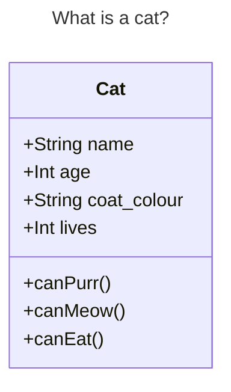

# Contents
- [Contents](#contents)
- [Week 10/Session 11 - Introduction to OOP](#week-10session-11---introduction-to-oop)
  - [Session Overview](#session-overview)
  - [Github Class Activities](#github-class-activities)
  - [Functions Revision and Expansion](#functions-revision-and-expansion)
    - [Functions - Revision](#functions---revision)
    - [Functions Advanced - Good and Bad Functions](#functions-advanced---good-and-bad-functions)
      - [Note on print and return](#note-on-print-and-return)
    - [Pure vs Impure Functions](#pure-vs-impure-functions)
  - [Modules](#modules)
    - [Modules Packages and Libraries](#modules-packages-and-libraries)
    - [Namespaces](#namespaces)
    - [Structuring a Python Program](#structuring-a-python-program)
  - [OOP](#oop)
    - [Background to Programming Paradigms](#background-to-programming-paradigms)
    - [What is OOP](#what-is-oop)
    - [What Are Objects](#what-are-objects)
    - [Objects Are Weird](#objects-are-weird)
  - [Summary](#summary)
    - [Programming Paradigms Comparison (GPT):](#programming-paradigms-comparison-gpt)
  - [Resources](#resources)
  - [Activities](#activities)

# Week 10/Session 11 - Introduction to OOP 
29/4/25  
[Blackboard Lesson Materials](https://blackboard.northmetrotafe.wa.edu.au/webapps/blackboard/content/listContentEditable.jsp?content_id=_3659649_1&course_id=_35877_1&content_id=_4785382_1)

[Raf's Lecture materials](https://github.com/NM-TAFE/civ-ipriot-in-class-demos/tree/2025/s1/raf)

## Session Overview
**Objectives**  
* Provide a context for object-oriented programming
* Create a custom class
* Instantiate an object of a custom class
* Define: instance, type, class, object, attribute, method

**Curriculum alignment**  
Aligns with the following elements of ICTPRG4302  
- 2.1 Develop application according to application design and organisational code conventions

**Relevance to industry**  
Object-oriented programming was and remains one of the most dominant paradigms for large-scale application development. In order to work as a software developer you must be able to work in an environment that applies object-oriented principles and apply these principles yourself.  

**Relevance to assessment**  
The remaining assessments will require you to write object-oriented code and today's class provides the most foundational knowledge and skills for this  

**How to use this information**  
* Follow the lecture slides and recording if applicable 
* If studying online, it is recommended to attempt the in-class activity **before** the class, as no time will be given in class for it
* Complete the revision activities 2 - 4 days after completing the lesson
___

## Github Class Activities
This class will shift away from Git, though it is still to be used, and assessments will assume Git knowledge. Assessment will be 'Smily' and will require Git.

Sessions will be run from Git Repos.

[Repo](https://github.com/NM-TAFE/civ-ipriot-in-class-demos)  
Use the 2025/s1/raf branch.
___


## Functions Revision and Expansion
Important concepts to revise and expand upon from ICTPRG302 are functions and modularity, as these are foundational to OOP

### Functions - Revision
Functiona are defined using the `def` keyword followed by the parameters that the function accepts in parentheses.  
This is a basic function defenition:
```python
def function_name(parameter1, parameter2):
    ...
```
**Note:** We *pass arguments* to a function, but we *define paramneters* of a function. Arguments are what is passed to a function when it is called eg `function_name(argument)`

Functions are called by referring to them, In Python, function names are just variables, but instead of the variable name referring to a literal, it referrs to a function.

**Why write functions:**  
The main reason functions are used is to MAINTAIN less code. Not only does it mean not having to repeat code that does the same thing over and over; it also means that if some aspect of that code doesn't work as intended, it is easy to find out where it is, what it does, and to maintain or fix it, as you only need ot look in one place (within the function), this keeps different parts of code organised and discreet.

Functions are useful because they make code modular, and break tasks into small, organised, discreet parts. It avoids repetition, and allows a **complex problem to be broken down into smaller more managable tasks**.

One of the biggest differences between an experienced programmer and a novice is that the experienced programmer is better at decomposing complicated problems into appropriate smaller problems.  

### Functions Advanced - Good and Bad Functions
As discussed, decomposing problems is important, but is a little bit more complex than just "breaking down big problems into smaller ones". While this is true, it is important to know *how* to do this, which has to do with the logic of the problem. 

#### Note on print and return
* **If the function produces a reusable value** → return it.
* **If the function just exists to show something** → print inside it.
* **If your function is meant to be flexible (like `calculator()`)** → return values and let the caller decide what to do with them.  

*Returns are also preferred in many instances as they can be used for unit tests.*

### Pure vs Impure Functions
Aiming to only use pure functions is a concept from [functional programming](#programming-paradigms-comparison-gpt), however it can often be a good practice (though not always), and the concept helps in understanding good decomposition.

**A pure function is one which:**
1. Always returns the same output for the same input
2. Has no side effects, i.e. doesn't affect the outside world in any other way than returning a value.

The idea of pure functions is to try to bring programming functions more in line with mathematical functions; e.g. "given an input, provide an output" `f(x) = x*2` or similar.

The main thing to be achieved is only to interact with the program outside of the function through arguments and return values. Meaning not calling on global variables, and not creating global variables within the function. Global variables are variables from outside the function.

**Side effects:**  
Side effects are anything a function does that affects the outside world except for returning a value.   
This includes things like displaying/printing/emialing/actuating a motor or servo.

Functional Programming requires zero side effects, as this reduces bugs. While this is something to aim for, it isn't always appropriate. For example if there are 0 side effects, a program doesn't really "do" anything.

**Instead:**  
The goal is for programs to have side effects, but not functions.

Instead we try to isolate side effects to just part of the code, and keep the functions as pure **as possible**.  

*The examples below illustrate why this is important:*  
**Bad Function: (Impure)**
```python
unit = 'f'
temperature = 104

def convert_temp():
    global converted_temp # Refers to a variable outside the function (creates it)
    if unit.lower() == 'f':
        converted_temp = (temperature - 32) * 5 / 9 # Side Effect - modifies a global variable.
    else:
        converted_temp = temperature * 9 / 5 + 32

convert_temp()
print(converted_temp)
```
*While the function works (as it is shown above) it depends on an external states, and is fragile.  
It also does a poor job of decomposing the problem, it would be better to remove the function and global variable, and just keep the if/else statement.*

**Better function**
```python
def convert_temp(unit, temperature):
    if unit.lower() == 'f':
        converted_temp = (temperature - 32) * 5 / 9
    else:
        converted_temp = temperature * 9 / 5 + 32
    return converted_temp

unit = 'c'
temperature = 38.8  
print(convert_temp(unit, temperature))
```
*In this version it is possible to look at the function in isolation and see if it is correct or not.*

While The purity of functions is not a part of the OOP paradigm it is the only paradigm that allows us to assert unequivocally whether a function is correct or not.

If it was necessary to print an error, for example tell a user that 'k' is not supported as a unit, instead of using a print statement withing the function (side effect), a better approach is to use `raise ValueError("Invalid Unit") or use try/except. This keeps the function pure.

**Even better function**
```python
def convert_temp(unit, temperature):
    if unit.lower() not in ['c', 'f']:
        raise ValueError("Invalid Unit")
    if unit.lower() == 'f':
        converted_temp = (temperature - 32) * 5 / 9
    else:
        converted_temp = temperature * 9 / 5 + 32
    return converted_temp
try:
    unit = 'k'
    temperature = 38.8  
    print(convert_temp(unit, temperature))
except ValueError:
    print("Please use a valid unit")
```

## Modules

### Modules Packages and Libraries 
... Turns out that *mostly*:
* **Module** - Typically a single file, a collection of defentitions (functions) that can be imported into another script or module - may or may not have standalone value. eg `math.py`, `os.py`
* **Script** - A python file that can be executed from the command line
* **Package** - A collection (often folderised) of modules (with `__init__.py`). eg `numpy/`
* **Library** - A collection of modules or packages offering tools. eg `requests`, `pandas` `flask`  

*They are all kind of used a bit interchangeably though, especially "Package".*

In the same way that functions break code up into useable pieces, modules perform a similar role; modules are small pieces of code that perfom a discrete function. For example the `random` module that is often imported.  

Although not previously covered it is possible to use any code we write as if it is a module in another program or script. We import it using `import` and the file name, without the .py extension; 
eg: to use even_better_function.py as a module, in a new file "my_program.py" could use:
```python
import even_better_function

print(even_better_function.convert_temp(42, 'c'))
# OR if only part of the module is required
from even_better_function import convert_temp

print(convert_temp(42, 'c'))
```

In python a file can be treated as both a script and a module, the only difference is in how you use it, ie. whether it is run directly in the command line, or imported, note that it has to be named using the correct function_naming_convention (eg `python_function.py` not `python-function.py`)

*But...*

### Namespaces  
When a module (or script or file) is imported in another file, python runs it. so in the example above,  `print(even_better_function.convert_temp(42, 'c'))` will result in side effects; the print statement within "even_better_function.py" will also be executed, this can cause confusion.

To use a file as both a script and a module, we use the "magic variable"; `__name__`.

If printing the value of `__name__` in a script, when it is run it will be `__main__`, however if we import it, `__name__` will be the name of the file (module).  

This means we can use the invocation `if __name__ == "__main__":` to encapsulate any execution that only want to happen if the file is run as a script.
```python
def convert_temp(unit, temperature):
    if unit.lower() not in ['c', 'f']:
        raise ValueError("Invalid Unit")
    if unit.lower() == 'f':
        converted_temp = (temperature - 32) * 5 / 9
    else:
        converted_temp = temperature * 9 / 5 + 32
    return converted_temp

def main():
    try:
        unit = 'k'
        temperature = 38.8  
        print(convert_temp(unit, temperature))
    except ValueError:
        print("Please use a valid unit")

if __name__ == "__main__":
    main()
```
*mainn doesn't have to be a function, the parts to be run as a script could also just sit below `if __name__ == "__main__":`, but placing the script logc in a `main()` function avoids namespace contamination.*


Namespaces are to variables what folders are to files, they are a container that holds a collection of names. They allow partitioning them into groups, there are four types of namespace:
* Built-in
* Global
* Local
* Enclosing or nonlocal  

The `.` (accessor) is used to access the names within a given namespace.

### Structuring a Python Program
1. Module doctsring
2. Imports
   1. Global
   2. Local
3. Constant/Global variables
4. Functions (with docstrings)
5. Invoke functions through main() last
6. If/nme/main

## OOP
OOP is ine of a few [programming paradigms](#programming-paradigms-comparison-gpt) (comparison below.)  It is less dominant now than it was previously as there is a move towards Functional Programming, which is becoming increasingly relevant in the industry. OOP it is still widely used and has useful applications for conceptualising coding (and the aus curriculum has nothing in it about FP for Cert IV or diploma courses)

### Background to Programming Paradigms 
OOP is less about how to solve problems, but how to understand the problem we are trying to solve; i.e how do we break down a problem.  

Coding is creative and collaborative and combinatorial, it builds upon itself. This can be obscured a bit during education where we are doing simple programming, solving a single relatively simple problem.  

On real world, large projects can get so complex that it is no longer maintainable. Addressing this is important. Some ways to address this include:
* **Modularity** - Identifying clear boundaries within an application with discrete responsibilities 
* **Decompisiotion** - Making one big problem into lots of smaller problems.
* **Reuse** - Finding multiple contexts and applications for the same code.  

*this was discussed [above](#modules)*  

**HOW** we aceive these goals is not solved, the [programming paradigms](#programming-paradigms-comparison-gpt) are different approcahes to finding a way to achieve them.  
Procedural Programming was one of the first paradigms, and is the "most natural"  - it is probably most akin to what we have been doing so far; you have a problem, so you start thinking about the seqential steps you would take to solve it.

It could be argued that OOP is the *least* intuitive of the programming paradigms, 

### What is OOP
OOP focuses on the **things** (objects) in the problem domain, defining their attributes and behaviours and making those objects interact with eachoter through clearly defined boundaries. This is different to thinking about the steps involved.

**Cake-making analogy:**  
If you were attempting to bake a cake:
* Taking a procedural programming approch, you might think "first I need a bowl, then eggss, flour, then I would mix those before getting a baking tray..."
* Using an Object-oriented approach, you might consider what things are involved (eggs, flour, mixer, oven... ), and defining them and their attributes, then their behaviours, and only after that how they would interact/combine.

While this approach is very useful for solving the "big" problems - *maintainability, collaboration, and combination* it is not so useful for smaller run-once type programs or scripts - this can make it hard to conceptualise for small projects, and may even be a hinderance to them.

### What Are Objects
*In an OOP sense something is an object once it is defined i.e. name(also sometimes called object), attribuutes, behaviours* 

**Basic Example:**  
 

Cats are things that have:  
attributes: a name, an age, a coat colour and a number (9 of course) of lives.
behavours: they can purr, meow and eat.

While all cats have these attributes and behavours, the values of these attributes and the implementation of these bahaviours may change:  
One individual cat is is named tex, is 5, has an orange coat, and has 7 lives.  
Another cat is called Scratchie, is 14 years old, has a grey coat and has 88 lives.  
But they still have the attributes in common.

In OOP languages an object is an instance of a type/Class. so tex is an object, he is an instance of the type cat.

### Objects Are Weird
**Eveything** in Python is an object, integers, strings, booleans, functions and classes are ALL objects. They have behaviours and attributes, but also every object has a type.

An object is an instance of thing of a certain type or class.  
In Python **type** and **class** are used interchangeably there are very subtle differences, but those are mostly meaningless.  

Some examples to try type() on:  
* "Hello"
* True
* None
* print
* def my_func()...
* str()
`<class 'type'>` means something is a class, or an object of type 'type'.  

Everything is an object, meaning it is of *type* object, but not everything is a class.  
There are built in classes we can use to construct objects of a particular type: int, bool, str, float etc.
We can also create our own types with the `class` keyword.

```python
class Cat: # create a type called "Cat"
    pass

c = Cat() # create a new instance of an object of type Cat
```
## Summary
The homework builds on this a lot! and it's a way to restructure and organise everything that has come before. It explains *why* we have been following the rules we have. OOP is not about solving "how to code this" problems, but second order problems: how do we conceptualise problem solving, and how do we approach it.

### Programming Paradigms Comparison (GPT):
1. Object-Oriented Programming (OOP)
   1. Core Idea: Organize code using objects, which bundle data (attributes) and behavior (methods).
   2. Focus: Modeling real-world entities and their interactions.
   3. Key Concepts: Classes, objects, inheritance, encapsulation, polymorphism.
   4. Example Use Case: Video games (where characters, weapons, and enemies are objects with behaviors).

        Example:
        ```python
        class Dog:
            def __init__(self, name):
                self.name = name

            def bark(self):
                print(f"{self.name} says woof!")

        fido = Dog("Fido")
        fido.bark()
        ```

2. Procedural Programming
   1. Core Idea: Organize code into procedures or functions.
   2. Focus: Step-by-step instructions (like a recipe).
   3. Common In: C, early Python scripts, Bash, etc.
   4. Pros: Simple, easy to follow for small programs.
   5. Cons: Harder to manage as complexity grows.

        Example:
        ```python
        def greet(name):
            print(f"Hello, {name}!")

        greet("Alice")
        ```

3. Functional Programming
   1. Core Idea: Build programs using pure functions and immutability.
   2. Focus: Avoid shared state and side effects.
   3. Key Concepts: First-class functions, higher-order functions, recursion.
   4. Popular In: Haskell, Lisp, Scala, but also supported in Python.

        Example:
        ```python
        def double(x):
            return x * 2

        nums = [1, 2, 3]
        doubled = list(map(double, nums))  # [2, 4, 6]
        ```

4. Declarative Programming
   1. Core Idea: Describe what you want done, not how to do it.
   2. Focus: Let the language or framework figure out the details.
   3. Seen In: SQL, HTML, some functional styles.

        Example (Declarative - SQL):
        ```sql
        SELECT name FROM users WHERE age > 18;
        ```
        You're not saying how to loop through users—just what you want.


**Summary:**
| Paradigm	  | Focus	                      | Example Use Cases                   |
|-------------|-------------------------------|-------------------------------------|
| OOP	      | Objects and interactions	  | Games, GUIs, simulations            |
| Procedural  | Step-by-step logic            | Scripts, small automation tasks     |
| Functional  |	Pure functions & immutability | Data transformations, concurrency   |
| Declarative |	What to do, not how           | Databases, UI layout, configuration |

These can all be done badly or well.
OOP can be the least intuitive of these and was dominant throughout the 90's, and is still dominant.


___
## Resources
[Lecture Slides](./resources/ipriot-oop-intro-v2.pptx)   
[In Class Demos](https://github.com/NM-TAFE/civ-ipriot-in-class-demos/tree/2025/s1/raf/week11)  
[Code Sample Repo](https://github.com/NM-TAFE/civ-ipriot-in-class-demos)  

[Revision Video - Classes](https://www.oreilly.com/videos/python-essentials/0636920926078/0636920926078-video365636/)  
[Revision Video - Self](https://www.oreilly.com/videos/python-essentials/0636920926078/0636920926078-video365640/)  

## Activities
[Lesson activity](./activities/lesson.md)  
[Lesson activity - Complete](./activities/lesson.py)  
[Pure Functions activity](./activities/pure-functions.md)  


**Test your understanding:**  
1. What is the main point of OOP in Python?  
    > Creating well organised code that effectively models the problem you are trying to solve.  
2. What is the difference between a class object and an instance object?
    > A class is description of a concept; for example "what relevant features do all cat's have in common? (name age, coat colour)". An instnace object is an individual impementation of a cat; "This particular cat's name age, coat colour"
3. Why is the first argument in a class’s method function special?  
    > This is the `__init__` method and defines what attributes are common to all instances within a given class. This is the method used when instantiating a class object.  
    > When I create an individual cat, what attributes must it have (even if those attributes are unique). for example: all cats have a name and a coat colour but the individual cat named 'Tex' has an 'orange' coat colour.
4. What is the `__init__` method used for?  
    > It is used to instantiate an instance of "cat" or whatever type the Class object is. This is done by calling the class object which runs it's `__init__` method. 
5. How do you create a class instance?  
    > By creating a new instance of the class including all the required attributes.
    > eg: `cat = Cat("Tex", "orange")`
6. How do you create a class?  
    > By using the `class` keyword, followed but the class name (which will be the type of each instance of class objects) followed by ':'
