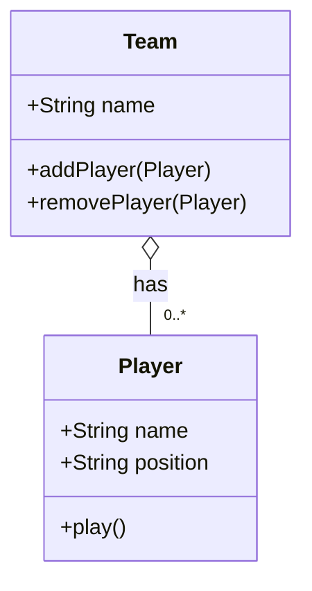

# Aggregation

An aggregation relationship in OOP, is a relationship where one object contains another object.

The containership is a "has-a" relationship, rather than an "is-a" relationship (inheritance). The aggregated object is a separate entity though. That is, it may be created or destroyed independently of the containing object, or it may move from one containing object to another.

In UML, an aggregation relationship is represented by an unfilled diamond shape pointing to the containing object.

## UML Example

> Ensure you have configured PyCharm to use the `mermaid` extension for class diagrams.



**Notice:**

- Cardinality `0..*`: A team can have zero or more players.
- Lifecycle: The players can exist independently of the team.
- A team must contain a reference to the players. This attribute is typically a collection such as a list and is implied by the aggregation symbol.

## Python Implementation

```python
# player.py
class Player:
    def __init__(self, name, position):
        self.name = name
        self.position = position

    def play(self):
        print(f"{self.name} plays {self.position} position")
```
```python
# team.py
from player import Player # Required if doing type hinting

class Team():
    def __init__(self, name: str): # Not necessary, but nice (type hinting)
        self.name = name
        self.players = []

    def add_player(self, player: Player): # Type hint for my own class!
        self.players.append(player) # a check if the player was in players[] would be nice
        return self.players # Not necessary unless the list is needed

    def remove_player(self, player: Player): # could `player: "Player"`` if not importing but it's jank.
        self.players.remove(player)
        return self.players
```
```python
# main.py
from player import Player
from team import Team

player1 = Player("Zorp \'Meatspin\' Vangelis", "Hyperflanker")
player2 = Player("Midge Chromefinger", "Backfield Distractor")

team = Team("Quantum Ferrets")
team.add_player(player1)
team.add_player(player2)

for player in team.players:
    player.play()

```
