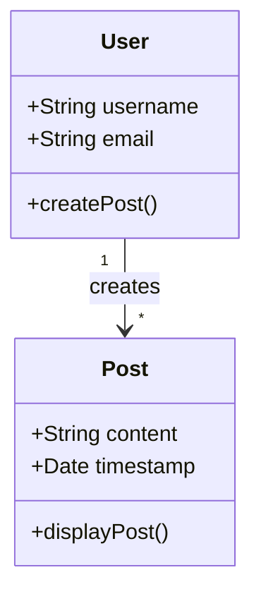

# Association

An association is a relationship between two classes. It is any kind of relationship that is not one of the other relationships we've discussed.

Associations can be unidirectional or bidirectional. Unidirectional associations are typically represented by a line with an arrowhead. Bidirectional associations are typically represented by a line with no arrowheads (but you'll see double-ended arrowheads sometimes, or just two lines etc).

Associations will typically also annotate the nature of the relationship (since association is a general term).


## UML Example

>Ensure that you have configured PyCharm to render mermaid diagrams.



## Python Implementation

```python
# post.py
from datetime import datetime

class Post:
    def __init__(self, content):
        self.content = content
        self.timestamp = datetime.today()

    def display_post(self):
        post = f"{self.content} \n {self.timestamp}"
        print(post)

# user.py
from post import Post

class User:
    def __init__(self, username, email):
        self.username = username
        self.email = email

    def create_post(self, content):
        return Post(content)

# main.py
from user import User
user = User('my_name', 'my_name@name.com')
post = user.create_post("Hello, world!")
post.display_post()
```
