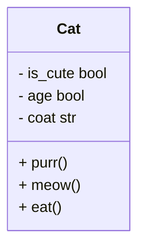
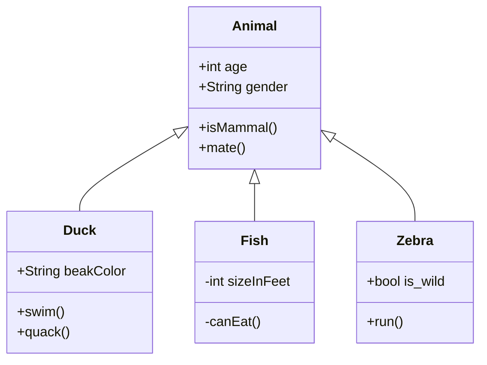
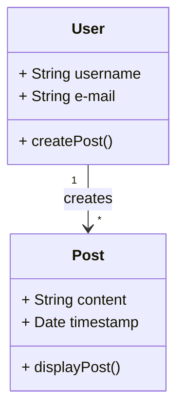
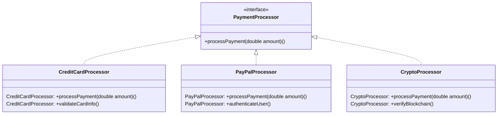
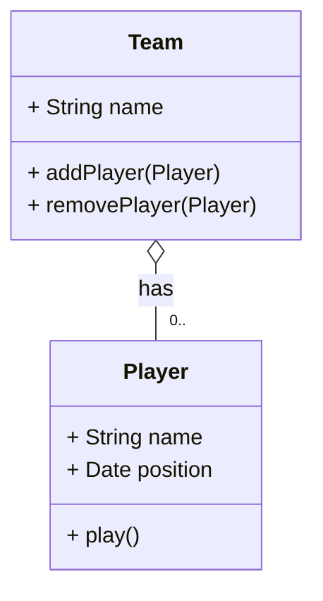
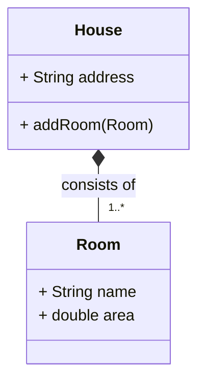
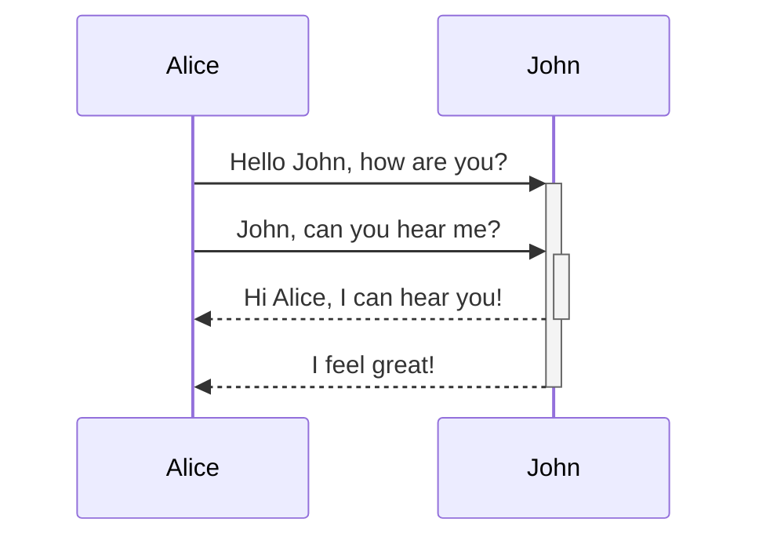

# Contents
- [Contents](#contents)
- [Week 12/Session 13 - Class Relationships and Remote Development](#week-12session-13---class-relationships-and-remote-development)
  - [SSH and remote deployment (Optional)](#ssh-and-remote-deployment-optional)
  - [Basics of UML](#basics-of-uml)
  - [Class Diagram](#class-diagram)
  - [Class relationships](#class-relationships)
    - [Inheritance](#inheritance)
    - [Association](#association)
    - [Realisation](#realisation)
    - [Aggregation](#aggregation)
    - [Composition](#composition)
  - [Class Relationship Attributes](#class-relationship-attributes)
    - [Cardinality](#cardinality)
    - [Direction](#direction)
  - [Sequence Diagram](#sequence-diagram)
  - [Use Case Diagram](#use-case-diagram)
  - [Activity Diagram](#activity-diagram)
  - [UML Tools](#uml-tools)
  - [Resources](#resources)
  - [Activities](#activities)

# Week 12/Session 13 - Class Relationships and Remote Development
13/5/2025  
[Blackboard Lesson Materials](https://blackboard.northmetrotafe.wa.edu.au/webapps/blackboard/content/listContent.jsp?course_id=_35877_1&content_id=_3663745_1)

[Raf's Lecture materials](https://github.com/NM-TAFE/civ-ipriot-in-class-demos/tree/2025/s1/raf)

## SSH and remote deployment (Optional)
A lot of written code is deployed remotely. Workflow of doing so with raspi is similar to doing so anywhere, a good thing to learn.

## Basics of UML
Unified Modelling Language (UML) is a standard for representing aspects of software design in diagrammatic form, including relationships between objects. It is less in use today than in the early 2000's but is still important to understand.

It originated from the desire to plan software in the same way that engineering projects were planned. Agile took over once it became apparent that while planning a project is important, very strict documentation and detailed plans can become an encumbrance and slow down development. 

Key types of diagrams:
* Class (now)
* Sequence (later)
* Use Case  (breifly now)
* Activity(~flowchart)
* There are 10 more types, but these aren't important (might encounter state diagrams).

The specification is managed by OMG and is about 800 pages long. It is not necessary to know all of this, the ability to read and write the more common types is sufficient.

## Class Diagram

Always name first then attributes, then methods. Even if there are no attributes or methods, the boxes will still be displayed empty.  
Also included is the data type of the attributes (these can be before or after the attribute name), and often the data type required for the methods.  

`+` is public, `-` is private, often we see that attributes will be private and methods will be public. This is due to OOP rules about encapsulation, no-one should be able to modify the attributes of a class from outside the class, but methods should be public.  

*Note that UML diagrams are often written in camel case, when translating the diagram into python code, PEP8 naming conventions should be used - this applies when converting to any language: use the conventions of that language.*

*If 'Void' is shown in a class diagram as a return type, that is equivalent to the None type in Python*

## Class relationships
So far we have learned about one type of class relationship: 
### Inheritance 

Called 'generalisation' in UML dieagrams. One class inherits attributes or methods from another, this relationship goes only in one direction.
* Represented in class digrams by an open (unfilled) arrow, which points **towards the parent**, joined by a solid line.

There are also other types of class relationship including 
### Association

Says something about the instance creation between one class and another, for example a method in one class might *create* an instance of another (example given was a user(class) on a social media app might create a post(class)). Not just that they are associated, but how they are associated, including [cardinality](#cardinality) and [direction](#direction). 
* Represented in class diagrams with a filled arrow.

### Realisation

Similar to inheritance relationships, but the superclass is an `<<interface>>`, they tend to be about behaviours, but *can* be about attributes also.
* Represented in class digrams by an open arrow, joined by dotted lines.

### Aggregation

An object contains another object for example a team contains a player (or many - see cardinality). Better thought of the player has a team. Most commonly the "player" will be added to some list within the "team".  
Unlinke Composition, the contained objects can exist indpendantly from the container - a player can change teams without being destroyed.
* Represented in class digrams by an unfilled diamond; this points towards the 'container' object (the team in the player/team example).

### Composition

Similar to aggregation, one object *consists of* others, for example a House is made up of rooms. It is slightly different in that the 'contained' ojects can not exist without the container, a room cannot exist if there is no house, and a room cannot be moved to a different house.  
The difference between aggregation and Composition is object lifecycle - NOT cardinality.  
This is important to understand for memory management, we don't want to hold onto objects that are no longer needed.
* Represented in class digrams by a filled diamond, the diamond points towards the 'container'.

## Class Relationship Attributes
In addititon attributes for these relationships include the **direction** and **cardinality**.  

### Cardinality
The multiplicity relationship between classes; one-to-one, one-to-may etc. A user might create many posts, but those posts are only created by one user. `*` in diagrams means 'infinite' or undefined so 1 uesr creates `*` (0-many) posts.

### Direction
The direction of a relationship, understanding which object is the parent of another - or which is dependant on another.

## Sequence Diagram

Sequence diagrams are used to show the interaction between objects in sequential order. They model dynamic behaviour in a system. Sequence diagrams illustrate object interactions, message flows, and the sequence of operations, making them valuable for understanding use cases, designing system architecture, and documenting complex processes. *(from geeks 4 geeks).*

## Use Case Diagram
These are generally created by a systems analyst, who uses them to communicate requirements to developers and stakeholders so that they can understand the system. Developers and stakeholders should be able to understand what they can do with a system, how they can use it and why.

## Activity Diagram
These are essentially flowcharts with some standardisation. Commonly flow charts are just used instead.

## UML Tools
Mermaid diagrams can be included in markdown, lightweight and preferred for general application.  
PlantText is possibly the most detailed and powerful tool, but requires seperate installation, and is not very lighteweight, generally only necessary for industry specific diagrams.  
Many IDEs can generate class diagrams from source but they don’t generally model relationships other than generalization/realization.  

___
## Resources
[Lecture Slides](./resources/ipriot-ssh-and-smiley.pptx)  
[Mermaid Class Diagrams](https://mermaid.js.org/syntax/classDiagram.html)  
[Mermaid Live Editor](https://mermaid.live/)  
[PlantText The expert's design tool](https://www.planttext.com/)  
[Flowchart and online diagram software](https://app.diagrams.net/)  
[Full Support of Mermaid Syntax](https://www.jetbrains.com/guide/go/tips/mermaid-js-support-in-markdown/)  
[UML Class Diagrams](https://www.visual-paradigm.com/guide/uml-unified-modeling-language/uml-class-diagram-tutorial/)  

## Activities
[In-class activity](./activities/class-activities.md)  
Complete actvities:  
* [Association](./activities/association/association.md)
* [Aggregation](./activities/aggregation/aggregation.md) 
* [Composition](./activities/composition/composition.md)