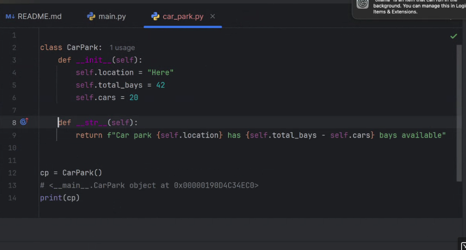

# Contents
- [Contents](#contents)
- [Week 15/Session 16 - Introduction to Project](#week-15session-16---introduction-to-project)
  - [Tasks for today](#tasks-for-today)
    - [Project Walkthrough](#project-walkthrough)
  - [Notes](#notes)
  - [Resources](#resources)
  - [Activities](#activities)


# Week 15/Session 16 - Introduction to Project
3/6/2025  

[Blackboard Lesson Materials](https://blackboard.northmetrotafe.wa.edu.au/webapps/blackboard/content/listContent.jsp?course_id=_35877_1&content_id=_3663755_1)  
[Raf's Lecture materials](https://github.com/NM-TAFE/civ-ipriot-in-class-demos/tree/2025/s1/raf)

* Overview of business proposal (software requirements)
* High-level design

## Tasks for today

1. Watch: [Video: Socratica Unit Test](https://www.youtube.com/watch?v=1Lfv5tUGsn8)

2. Complete: [Week 14 activities](../week_14-unit%20testing/activities/class-activities.md)

3. Watch this project intro: [Blackboard: Raf Project Intro](https://au-lti.bbcollab.com/collab/ui/session/playback)


Start on the carpark project - try to at least get to the point where you have stubs for each of the classes in PyCharm and have GitHub set up. Confirm you can import your src modules to the tests/ folder (if not you need to configure the PyCharm directories):

[Project overview on Github](https://github.com/NM-TAFE/civ-ipriot-in-class-demos/blob/main/assessments/prj/carpark-guide.md)

### Project Walkthrough
**Project Overview (Video):**  
An overview of the project, and what is required may be found here:  
[Class Collaborate - Overview of Project](https://au-lti.bbcollab.com/collab/ui/session/playback/load/96a8ebe85661479d988586db82bb1cd3)  

**Project Guide (Markdown Document)**  
The following external link (to GitHub) contains a (recommended) plan for completing the project.  
[As Above](https://github.com/NM-TAFE/civ-ipriot-in-class-demos/blob/main/assessments/prj/carpark-guide.md)  

**Further Assistance:**  
If you are encountering issues with the project then we provide video content in sections below to assist.
You may also use the https://help.screencraft.net.au helpdesk to send a request to your lecturer for assistance.

## Notes
Don't have to set git name to student name/number our "real" github name is fine.  

Think of core nouns/objects (from specification):
- Carpark
- Sensor
- Display
- Cars*
- Licence Plate*
- Bays* attribute of carpark?

*these we might come back to - may end up being attributes  

We will find as we define the system that we need more nouns like configuration, there are two levels of nouns, some will be classes some will be attributes.   
e.g. licence plate is a string  - it may be one of a list of strings as part of the car park.

Cars might be a class that has a licence plate attribute, or it might be better to have them as an attribute.  

Analysis by paralysis - avoid it, start than change things later.  
Harder to demote classes into attributes than vice-versa.  
Don't need to track individual bays or types - just track number available.  
YAGNI - You Ain't Gonna Need It. Don't give into scope creep and design paralysis.  
```
Carpark  
  location: str  
  plates: list[str]  
  ~~available_bays: int~~  
  total_bays: int  
  number_of_cars: int  
  -------------------
  + add car
  + remove car
  - log activity
  + update status
```
Sensor  
* registers car calls update_status() - polling is keep pinging, instead publisher/subscriber is better here (sensor will publish to car park - the subscriber).

Display  
* message: str
* weather: ??

Follow requirements, but use common sense (don't go overboard).  
AT3 md guide creating stubs.  
implement the 3 classes  

Bug exposure, plates > cars, cars > bays. maybe count the plate scans AND cars.




get up to config class.
___
## Resources
[Lecture Slides](<../week_14-unit testing/resources/ipriot-unittest.pptx>)  

[Video: Socratica on Unit Testing](https://www.youtube.com/watch?v=1Lfv5tUGsn8)  
[Zip: Socratica Source Code](<../week_14-unit testing/resources/testing-overview.zip>)  

*Optional:*

[Zip: File String Num](<../week_14-unit testing/resources/string_num_value.zip>)  
[Geeks for Geeks - Python Unit Testing](https://www.geeksforgeeks.org/unit-testing-python-unittest/)  

[Video: Python TDD Workflow - Unit Testing Code Example for Beginners](https://www.youtube.com/watch?v=ibVSPVz2LAA)

## Activities
Week 14 activities