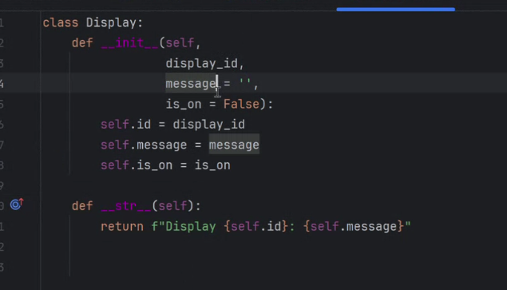
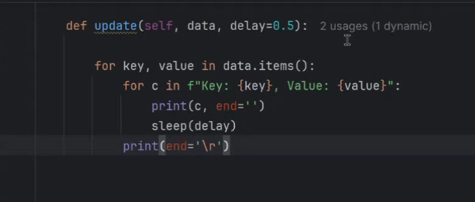

# Contents
- [Contents](#contents)
- [Week 16/Session 17 - Project information](#week-16session-17---project-information)
  - [Tasks for today](#tasks-for-today)
  - [Notes](#notes)
  - [Resources](#resources)
  - [Activities](#activities)


# Week 16/Session 17 - Project information
3/6/2025  

[Blackboard Lesson Materials](https://blackboard.northmetrotafe.wa.edu.au/webapps/blackboard/content/listContent.jsp?course_id=_35877_1&content_id=_3663755_1)  
[Raf's Lecture materials](https://github.com/NM-TAFE/civ-ipriot-in-class-demos/tree/2025/s1/raf)

## Tasks for today
should have completed up to part 2.7 

## Notes
Sensors for in and out  only, not each bay  
Keep space for multiple carparks (location) - don't use the project overview it was wrong.  
Read up on tags  
uncontrolled carpark means there are no boom gates
methods with a lot of parameters can be split across lines.  


How to think about setting default values:  
if you don't set a default then an object can't exist unless it is stated. eg carpark location. i.e user must enter it.

if you want you can use _plates = [] but it's not good because the default argument is mutable.
If a variable can change don't use a default. Use a default value of none if a value is optional.
_plates = None

don't do self.sensors = sensors in Carpark class

use a pattern of `self.plates = _plates or []` if plates is nne, it will go on to create a list



Things with defaults should come after things without.

Properties 
`@property` decorator
available bays, does need to be calculated, but doesn't nee to be a method - make it a property of car parks. a property is something that allows getting, setting or deriving attributes. They are useful for protecting private attributes as well. 

if more cars in carpark than bays, still want 0 bays available (not negative!)  

```python
from time import sleep

sleep (0.5)
```

get to 2:13 by next week.


## Resources


## Activities
