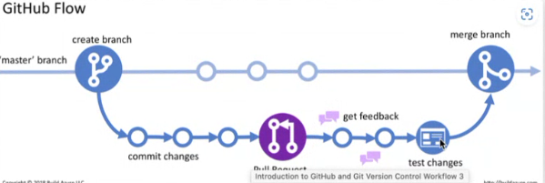
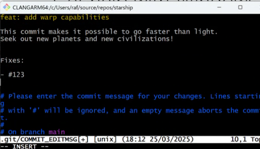

# Contents
- [Contents](#contents)
- [Week 7/Session 8 - Development Workflows](#week-7session-8---development-workflows)
  - [whats software development looks like](#whats-software-development-looks-like)
  - [How software dev looks with Git](#how-software-dev-looks-with-git)
  - [Workflow we'll employ at TAFE](#workflow-well-employ-at-tafe)
  - [Releases](#releases)
    - [Lightweight tags](#lightweight-tags)
  - [Resources](#resources)

# Week 7/Session 8 - Development Workflows
https://blackboard.northmetrotafe.wa.edu.au/webapps/blackboard/content/listContent.jsp?course_id=_35877_1&content_id=_3669678_1  

Key policies, procedures and documentation required to use version control systems in development environments:
* principles and techniques of creating repositories and branch workflows
* version control industry standard best practices distributed version control industry standard best practices
* workflow processes applicable to using version control systems

*second last git session, next week will be for assignments.*

Git in terms of real sofware dev, and feeds into assessment for next term (most tiime will be IP4RIoT will be more intense).  

## whats software development looks like
Bit of dev ops stuff.  
There's a difference between being able to code and understanding software development.  

Software dev is a creative activity, it incudes
* Research and development
  * often don't know what we don't know
* Failure
  * Plenty of unkowns and things will fail, less so if you are well prepared
* Risk in software includes:
  * Opportinity costs (could be doing something else)
  * Loss of investment (hiring costs coders/marketers/others)
  * Business disruption (changes may affect operations in business)

`risk = likelihood * cost`

**Reducing the Likelihood of Failure:**  
* Do a lot of planning
* Reseaerch the problem extensively
* Ensure there is a market
* Hire developers with a lot of specific experience in the domain you want to enter - can be difficult (or late to market).

This is a pradox, as this can also increase cost (therefore risk). It takes balance, too muck "risk mitigation" can be counterproductive.

Modern approach to software dev minimises risk by increasing cost and "fail fast, fail early". There is now less engineering envy. Not like building a bridge, where you check if it will be used then spend years on designing it perfectly.  

Your competitors are everyone, potentially anyone can make an app, so ideas are important. Secrecy is rarely useful.  

Old approach to dev was the waterfall approach, clear stages of development (analysis, design,, implementation, testing, development, maintenance)... it was slow.  

Now being agile is preferred: iterative, fluid transition between all stages. "Agile" and agile inspired methodologies are more popular today.  

Check out "the agile manifesto", emphasis on interpersonal communication.  

Now there is a movement against agile; it got over-managed, agile can lead to cowboy-development, also "daily scrum meetings".  

The original idea was that it was based on what the team needs, not copy pasted... but then it became a bit "copy-paste".

## How software dev looks with Git
There are still benefits to thinking of sofware dev in terms of the waterfall method, however not too much, it made version control siloed with development, testing and production.

Now software releases so much more quickly (browswers, patches etc)

With agile things are less siloed, everyone kind of work on main. Things like Microsoft and google likely use a hybrid approach.  

Consequences of agile are:
* Cultural
  * Emphasis on reviews/collaboration/individual responsibility
* Technical (Increased automation)
  * Unit Testing
  * Integration testin
  * Static Analysis
  * Deployment
    * Compiling
    * Publishing
    * Documentation

Documentation is often done as code rather than as a seperate thing. There are a lot more tools now for that (comments and docstrings). Documentation is now woven into the code and process.

Version control system is key for agile
* Automation
  * Hooks
* Failure tolerance
* PR's
  * Communication
  * Collaboration

This all increases the risk of failure, but reduces the cost.

## Workflow we'll employ at TAFE
Using git and IDE's
Understand whent to branch, when to merge, who can merge, requirements for merging.

Follow standards for commit messages.build muscle memory by following standards, less important in IP4RIoT. Using version control is more imporrtant than how you use it (for now).

Better to do 100 commits, with 3 well formatted, than only 3 that are well formatted. - Know how to identify commit message standards.

**Github  Flow**
* Feature Branching
* Oull request
* Merge and delete branch
* Approvals and Automation through github actions (more next week and semester).

github flow is nicer than git flow.  
  

Testing is important before merging to avoid conflicts. Check code coverage, make sure all code is code is covered by tests.  

Commit message standards are used to help make commits understandable and easy to read because they need to be reviewed.

will likley not add documentation/style tags for commit messages.

Commit messages are in the present tense.
  

## Releases
A release is a snapshot of the project in time that is packaged for the end user. It includes compiled binaries (if applicable), source code, documentation and release notes.
Release notes summarise changes between releases.

Write better release notes than Apple (or games). Not "bug fixes".

### Lightweight tags
Is a reference to a commit, used as a bookmark (can put something meaningful). can make it easier to find old versions in Git. See annotated tags - references to specific commits.

`git tag -a v1.0.0 -m "Important version"`

## Resources
[Lecture Slides](./resources/civ-ipriot-dev-workflow.pptx)  
[Example Onboarding Repo](https://github.com/NM-TAFE/ipriot-nms-org-template/tree/main)  
[GitHub Flow: The recommended workflow in NMTAFE](https://blog.hubspot.com/website/what-is-github-used-for)  
[Git Best Practices](https://coderefinery.github.io/git-intro/what-to-avoid/)  
